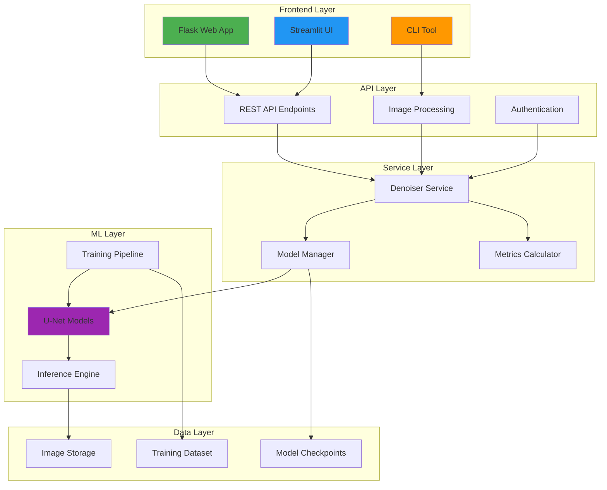
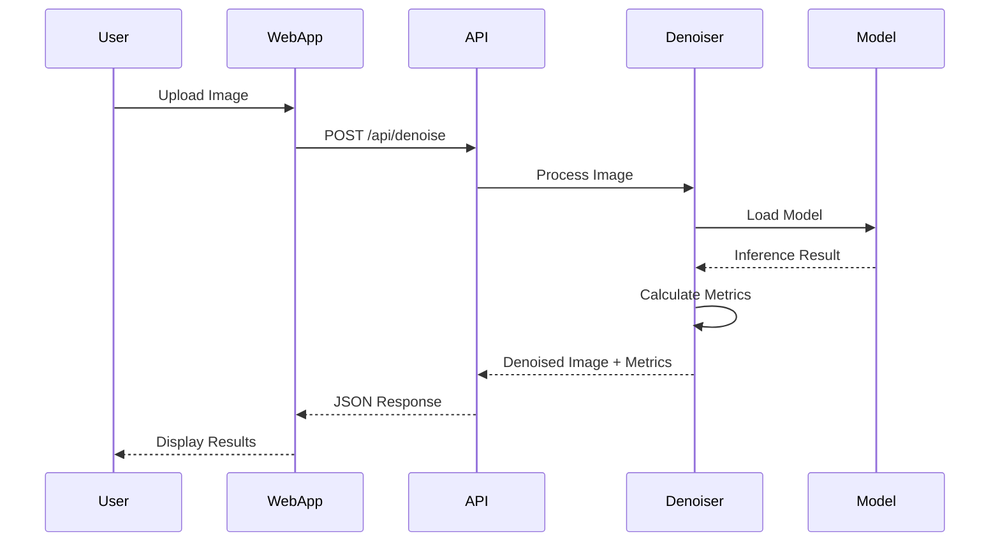

<div align="center">

# NeuroScope
### AI-Powered Microscopy Image Denoising System

[](https://www.python.org/)
[](https://pytorch.org/)
[](https://flask.palletsprojects.com/)
[](LICENSE)
[](https://github.com/psf/black)

**Advanced deep learning pipeline for restoring microscopy images using state-of-the-art U-Net architectures with CARE-inspired training methodology.**

[🚀 Features](#-features) · [🏗️ Architecture](#-system-architecture) · [📚 Documentation](#-documentation) · [🔧 Installation](#-installation--setup) · [💡 Usage](#-usage-guide)

</div>

---

## 📋 Overview

NeuroScope is a production-grade AI system designed to address the critical challenge of noise in microscopy imaging. Microscopy images often suffer from photon shot noise, sensor noise, and various artifacts that obscure fine cellular structures and compromise quantitative analysis. This project implements a complete end-to-end deep learning pipeline inspired by the groundbreaking CARE (Content-Aware Image Restoration) framework, specifically optimized for fluorescence microscopy and related imaging modalities.

### 🎯 Problem Statement

Microscopy imaging is fundamental to biological research, medical diagnostics, and materials science. However, acquired images frequently contain significant noise that:
- Obscures critical cellular structures and organelles
- Reduces the accuracy of quantitative measurements
- Limits the effectiveness of automated image analysis
- Requires longer exposure times that can damage samples
- Increases computational burden for downstream processing

### 💡 Why This Project Matters

NeuroScope demonstrates the practical application of deep learning to solve real-world scientific problems:
- **Preserves Biological Fidelity**: Maintains fine structural details while removing noise
- **Quantitative Validation**: Provides PSNR and SSIM metrics for objective quality assessment
- **Multiple Architectures**: Implements Standard, Enhanced, and Residual U-Net variants for optimal performance
- **Production-Ready**: Includes web application, CLI tools, and comprehensive testing
- **Research-Backed**: Based on peer-reviewed CARE methodology with custom improvements

### 🎯 Key Objectives

- Implement robust U-Net architectures optimized for grayscale microscopy images
- Develop combined L1 + SSIM loss function for balanced reconstruction
- Create production-ready inference pipeline with multiple deployment options
- Provide comprehensive training tools with validation and early stopping
- Deliver intuitive web interface for researchers and clinicians
- Ensure reproducibility through structured configuration and documentation

---

## 🚀 Features

### 🧠 Deep Learning Models
- **Multiple U-Net Architectures**: Standard, Enhanced (with residual blocks), and Residual variants
- **Advanced Loss Function**: Combined L1 + SSIM loss for balanced structural preservation
- **Flexible Training**: Support for CARE-style paired datasets with optional augmentation
- **Model Optimization**: GroupNorm for small-batch stability, configurable depth and channels
- **Checkpoint Management**: Automatic best-model saving based on validation PSNR

### 🌐 Web Applications
- **Production Flask API**: RESTful endpoints for image upload, denoising, and download
- **Modern Streamlit UI**: Interactive interface for local development and prototyping
- **Responsive Design**: Mobile-friendly interface with real-time status monitoring
- **Multiple Denoising Modes**: U-Net, auto-routing, salt-and-pepper filter, brightfield mask
- **Real-time Metrics**: PSNR and SSIM calculation with visual feedback

### 🔧 Training Pipeline
- **CARE Dataset Support**: Paired noisy/clean image loading with automatic matching
- **Data Augmentation**: Random flips and rotations for improved generalization
- **Advanced Training Features**: Learning rate scheduling, early stopping, TensorBoard integration
- **Validation Tracking**: Real-time PSNR and SSIM monitoring during training
- **Sample Visualization**: Automatic generation of training progression comparisons

### 📊 Inference Capabilities
- **CLI Tool**: Batch processing for single images or entire directories
- **Web API**: RESTful endpoints with automatic model warm-up
- **Multiple Output Formats**: Comparison images, individual results, metrics reports
- **Flexible Model Loading**: Support for PyTorch checkpoints and ONNX runtime
- **Thread-Safe Service**: Lazy-loaded model inference with concurrent request handling

### 🛠️ Technical Features
- **ONNX Runtime Support**: Optional deployment-optimized inference
- **Environment Configuration**: Flexible environment-based settings
- **Error Handling**: Comprehensive exception handling and logging
- **Memory Optimization**: Efficient image processing with configurable batch sizes
- **Cross-Platform**: Compatible with Linux, macOS, and Windows

---

## 📸 Screenshots

### Web Application Interface
*Upload interface with drag-and-drop support and real-time model status*

### Denoising Results
*Side-by-side comparison showing original noisy image and AI-restored output with quality metrics*

### Training Progress
*TensorBoard-style training curves showing loss, PSNR, and SSIM improvement over epochs*

---

## 🏗️ System Architecture

### High-Level Architecture



### Data Flow Architecture



### Component Interaction

```mermaid
graph LR
    subgraph "Input Processing"
        A[Raw Image] --> B[Preprocessing]
        B --> C[Grayscale Conversion]
        C --> D[Resize & Normalize]
    end
    
    subgraph "Model Inference"
        D --> E[U-Net Encoder]
        E --> F[Bottleneck]
        F --> G[U-Net Decoder]
        G --> H[Skip Connections]
    end
    
    subgraph "Output Processing"
        H --> I[Postprocessing]
        I --> J[Resize to Original]
        J --> K[Denormalize]
        K --> L[Quality Metrics]
    end
    
    L --> M[Final Output]
    
    style B fill:#E3F2FD
    style E fill:#F3E5F5
    style I fill:#E8F5E9
```



---

## 🔧 Tech Stack

### Backend Framework
| Technology | Purpose |
|------------|---------|
| **Python 3.11+** | Core language with modern type hints and async support |
| **Flask 3.x** | Lightweight web framework for REST API |
| **PyTorch 2.2+** | Deep learning framework for model training and inference |
| **ONNX Runtime 1.15+** | Optional deployment-optimized inference engine |

### Machine Learning
| Component | Implementation |
|-----------|----------------|
| **Model Architecture** | Custom U-Net variants (Standard, Enhanced, Residual) |
| **Loss Function** | Combined L1 + SSIM (0.7:0.3 ratio) |
| **Optimizer** | Adam with learning rate scheduling |
| **Normalization** | GroupNorm for small-batch stability |
| **Activation** | ReLU with inplace operations |

### Image Processing
| Library | Usage |
|---------|-------|
| **OpenCV** | Image I/O, preprocessing, augmentation |
| **Pillow** | Image format handling and conversion |
| **NumPy** | Numerical operations and array manipulation |
| **Albumentations** | Advanced data augmentation (training mode) |

### Frontend Technologies
| Technology | Purpose |
|------------|---------|
| **HTML5/CSS3** | Responsive web interface with modern styling |
| **JavaScript (ES6+)** | Client-side interactions and API communication |
| **Streamlit** | Alternative Python-based UI for rapid prototyping |
| **CSS Grid/Flexbox** | Modern layout system for responsive design |

### Development Tools
| Tool | Purpose |
|------|---------|
| **TensorBoard** | Training visualization and metrics tracking |
| **tqdm** | Progress bars for training and inference |
| **matplotlib** | Training curve generation and visualization |
| **pytest** | Unit testing framework |

### File Formats Support
| Format | Support Level |
|--------|---------------|
| **PNG** | Full support (recommended) |
| **JPEG/JPG** | Full support |
| **TIFF/TIF** | Full support |
| **WebP** | Full support |
| **BMP** | Full support |

---

## 📁 Project Structure

```
AI Image Denoising In Microscopy/
├── application.py              # Flask production web application
├── app.py                      # Streamlit UI prototype
├── config.py                   # Environment-based configuration management
├── train.py                    # Model training script with advanced features
├── inference.py                # CLI inference tool for batch processing
├── requirements.txt            # Core dependencies (Flask, ONNX, etc.)
├── requirements_torch.txt     # Extended dependencies for training
│
├── src/                        # Core deep learning modules
│   ├── unet_model.py          # U-Net architecture implementations
│   ├── care_dataset.py       # Original CARE dataset loader
│   └── care_dataset_simple.py # Simplified dataset implementation
│
├── services/                   # Application service layer
│   ├── denoiser.py           # Thread-safe inference service
│   ├── bootstrap.py          # Startup helpers and directory management
│   └── model_utils.py        # Model type detection and utilities
│
├── utils/                      # Shared utility modules
│   ├── preprocessing.py      # Image preprocessing pipeline
│   ├── metrics.py            # PSNR, SSIM, and quality calculations
│   ├── losses.py             # Custom loss functions
│   ├── salt_pepper.py        # Salt-and-pepper noise removal
│   └── brightfield.py        # Brightfield object mask processing
│
├── templates/                  # Flask HTML templates
│   └── index.html            # Main web application interface
│
├── static/                     # Static web assets
│   ├── css/                   # Stylesheets
│   └── js/                    # Client-side JavaScript
│
├── ui/                         # Streamlit UI components
│   ├── components.py          # Reusable UI elements
│   └── run_layout.py          # Layout configuration
│
├── scripts/                    # Utility scripts
│   ├── export_inference_checkpoint.py  # Model optimization for deployment
│   └── process_microscopy_dataset.py  # Dataset preprocessing
│
├── models/                     # Trained model checkpoints (git-ignored)
│   ├── deploy/                # Production-ready models
│   └── overfit_residual_blocks/  # Experimental models
│
├── data/                       # Training datasets (git-ignored)
│   └── train/
│       ├── noisy/             # Noisy microscopy images
│       └── clean/             # Ground truth clean images
│
├── uploads/                    # Runtime upload directory (auto-created)
├── outputs/                    # Denoised output directory (auto-created)
├── logs/                       # TensorBoard logs and training artifacts
└── tests/                      # Unit and integration tests
```

---

## 🔧 Installation & Setup

### Prerequisites

- **Python 3.11+** with pip package manager
- **Virtual Environment** (recommended but not required)
- **CUDA** (optional, for GPU-accelerated training)
- **8GB+ RAM** recommended for training
- **2GB+ disk space** for dependencies and models

### Step 1: Clone Repository

```bash
git clone https://github.com/YOUR_USERNAME/AI-Image-Denoising-In-Microscopy.git
cd AI-Image-Denoising-In-Microscopy
```

### Step 2: Create Virtual Environment

```bash
# Create virtual environment
python -m venv .venv

# Activate (Linux/macOS)
source .venv/bin/activate

# Activate (Windows)
.venv\Scripts\activate
```

### Step 3: Install Dependencies

```bash
# Core dependencies (web app and inference)
pip install -r requirements.txt

# Extended dependencies (training and development)
pip install -r requirements_torch.txt
```

### Step 4: Environment Configuration

```bash
# Copy example environment file
cp .env.example .env

# Edit .env with your configuration
# Required variables:
# - MODEL_PATH=models/deploy/model.pt
# - SECRET_KEY=your-secret-key-here
# - PORT=5000
```

### Step 5: Prepare Model Weights

```bash
# Option 1: Use provided model
# Place model.pt in models/deploy/

# Option 2: Export from training checkpoint
python scripts/export_inference_checkpoint.py \
  --input models/overfit_residual_blocks/best_model.pth \
  --output models/deploy/model.pt
```

### Step 6: Verify Installation

```bash
# Test Flask application
python application.py
# Visit http://localhost:5000

# Test Streamlit interface
streamlit run app.py
# Visit http://localhost:8501
```

---

## 💡 Usage Guide

### Web Application (Recommended)

#### Starting the Flask Server

```bash
python application.py
# Server runs on http://localhost:5000
```

#### Using the Interface

1. **Upload Image**: Drag and drop or click to select a microscopy image
2. **Select Mode**: Choose denoising algorithm (Auto, U-Net, Salt-Pepper, Brightfield)
3. **Process**: Click "Start denoising" to begin processing
4. **View Results**: Compare side-by-side with quality metrics
5. **Download**: Save denoised image to local storage

#### API Endpoints

<details>
<summary>📖 API Documentation</summary>

### Health Check
```http
GET /health
```
**Response**: Service status and model readiness

### Model Status
```http
GET /api/status
```
**Response**: Detailed model information and loading state

### Denoise Image
```http
POST /api/denoise
Content-Type: multipart/form-data
```
**Parameters**:
- `image`: Image file (required)
- `mode`: Denoising mode (optional, default: "auto")

**Response**: JSON with base64-encoded images and metrics

### Download Result
```http
GET /api/download/<filename>
```
**Response**: Denoised image file
</details>

### Command Line Interface

#### Single Image Processing

```bash
python inference.py \
  --model models/deploy/model.pt \
  --input path/to/noisy_image.png \
  --output results/
```

#### Batch Directory Processing

```bash
python inference.py \
  --model models/deploy/model.pt \
  --input_dir path/to/noisy_images/ \
  --output_dir results/ \
  --batch
```

#### Advanced Options

```bash
python inference.py \
  --model models/deploy/model.pt \
  --input image.png \
  --output results/ \
  --ground_truth clean_image.png \
  --save_comparison \
  --metrics_only \
  --device cuda
```

### Training Pipeline

#### Basic Training

```bash
python train.py \
  --data_dir data \
  --epochs 50 \
  --batch_size 8 \
  --lr 0.001 \
  --save_dir models
```

#### Advanced Training Configuration

```bash
python train.py \
  --data_dir data \
  --model_type residual \
  --epochs 100 \
  --batch_size 16 \
  --lr 0.0001 \
  --val_split 0.2 \
  --early_stop_patience 15 \
  --augment \
  --save_dir models \
  --log_dir logs \
  --sample_indices 0 1 2
```

#### Training with GPU

```bash
python train.py \
  --data_dir data \
  --epochs 50 \
  --batch_size 16 \
  --device cuda \
  --save_dir models
```

---

## 🔒 Security Features

### Input Validation
- **File Type Enforcement**: Strict whitelist of allowed image formats
- **Size Limits**: Configurable maximum file size (default: 50MB)
- **Content Validation**: Image format verification before processing
- **Path Sanitization**: Secure file path handling to prevent directory traversal

### Error Handling
- **Graceful Degradation**: Fallback mechanisms for model loading failures
- **Comprehensive Logging**: Detailed error tracking for debugging
- **User-Friendly Messages**: Clear error messages without exposing internals
- **Exception Isolation**: Request-level error handling to prevent system crashes

### Resource Management
- **Memory Limits**: Configurable memory constraints for large images
- **Timeout Protection**: Request timeout handling for long-running operations
- **Thread Safety**: Lock-based concurrent access control
- **Resource Cleanup**: Automatic cleanup of temporary files

### Environment Security
- **Secrets Management**: Environment-based configuration for sensitive data
- **No Hardcoded Credentials**: All secrets loaded from environment variables
- **Secure Defaults**: Safe default configurations for production use

---

## ⚡ Performance Optimizations

### Model Optimization
- **GroupNorm Implementation**: Batch-size independent normalization for stability
- **Inplace Operations**: Memory-efficient ReLU activations
- **Lazy Loading**: Model loaded only on first request
- **ONNX Runtime**: Optional deployment-optimized inference engine

### Training Optimizations
- **Learning Rate Scheduling**: ReduceLROnPlateau for adaptive learning rates
- **Early Stopping**: Automatic termination when validation metrics plateau
- **Gradient Clipping**: Optional gradient norm limiting for training stability
- **Mixed Precision**: CUDA AMP support for faster GPU training

### Inference Optimizations
- **Thread-Safe Service**: Concurrent request handling with proper locking
- **Model Caching**: Single model instance shared across requests
- **Image Preprocessing**: Optimized numpy-based pipeline
- **Batch Processing**: Efficient handling of multiple images

### Memory Management
- **Efficient Data Loading**: Configurable DataLoader with memory pinning
- **Image Chunking**: Large image processing in manageable chunks
- **Garbage Collection**: Automatic cleanup of intermediate results
- **Stream Processing**: Minimal memory footprint for large datasets

---

## 🧩 Challenges & Solutions

### Challenge 1: Small Batch Training Stability
**Problem**: Traditional BatchNorm fails with small batch sizes common in microscopy due to memory constraints.

**Solution**: Implemented GroupNorm with dynamic group calculation based on channel count, ensuring stable training regardless of batch size.

### Challenge 2: Preserving Fine Structural Details
**Problem**: Standard L1 loss can blur fine cellular structures during denoising.

**Solution**: Combined L1 + SSIM loss function (0.7:0.3 ratio) to balance pixel-level accuracy with structural similarity preservation.

### Challenge 3: Memory Constraints During Inference
**Problem**: Large microscopy images can exceed available GPU memory.

**Solution**: Implemented CPU-first inference with optional GPU support, efficient image chunking, and memory-aware preprocessing pipeline.

### Challenge 4: Dataset Pair Matching
**Problem**: CARE datasets require exact filename matching between noisy and clean images.

**Solution**: Automated filename-based matching with validation, reporting unmatched files, and flexible pattern support.

### Challenge 5: Production Deployment Complexity
**Problem**: PyTorch models have large memory footprint and deployment overhead.

**Solution**: Implemented ONNX runtime support for deployment-optimized inference, reducing memory requirements and improving startup time.

---

## 🚀 Future Enhancements

### Short-term Roadmap
- [ ] **Model Ensemble**: Combine multiple U-Net variants for improved performance
- [ ] **3D Image Support**: Extend architecture for volumetric microscopy data
- [ ] **Advanced Augmentation**: Add more sophisticated data augmentation techniques
- [ ] **Docker Support**: Containerized deployment for reproducible environments
- [ ] **API Authentication**: Add secure authentication for production deployments

### Medium-term Goals
- [ ] **Real-time Processing**: Optimize for near real-time inference on moderate hardware
- [ ] **Mobile Support**: Create mobile-friendly interface and lightweight models
- [ ] **Cloud Integration**: Add support for cloud storage and distributed processing
- [ ] **Advanced Metrics**: Implement additional quality assessment metrics
- [ ] **Transfer Learning**: Support for pre-trained models on public datasets

### Long-term Vision
- [ ] **Multi-modal Support**: Handle various microscopy modalities (confocal, SEM, TEM)
- [ ] **Self-supervised Learning**: Implement training without paired clean images
- [ ] **Interactive Refinement**: Allow user-guided denoising parameter adjustment
- [ ] **Publication-Ready Outputs**: Generate publication-quality figures and reports
- [ ] **Community Models**: Platform for sharing and comparing denoising models

---

## 🎓 Learning Outcomes

### Technical Skills Demonstrated
- **Deep Learning Architecture Design**: Custom U-Net implementations with advanced features
- **Production Software Engineering**: REST API design, error handling, and logging
- **Computer Vision**: Image preprocessing, augmentation, and quality assessment
- **Training Pipeline Development**: Loss function design, optimization, and validation
- **Performance Optimization**: Memory management, concurrent processing, and deployment

### Engineering Practices
- **Modular Architecture**: Clean separation of concerns across multiple modules
- **Configuration Management**: Environment-based configuration for flexibility
- **Testing Strategy**: Unit testing and integration testing approaches
- **Documentation**: Comprehensive code documentation and user guides
- **Version Control**: Git workflow and branch management

### Research Implementation
- **Paper Reproduction**: Implementation of CARE methodology with custom improvements
- **Experimentation**: Systematic hyperparameter tuning and architecture comparison
- **Metrics Analysis**: Understanding and implementing image quality metrics
- **Result Validation**: Quantitative and qualitative assessment of model performance

---

## 🌟 Why This Project Stands Out

### Engineering Excellence
- **Production-Ready Architecture**: Not just a research prototype, but a deployable system
- **Multiple Deployment Options**: Flask web app, Streamlit UI, and CLI tools for different use cases
- **Comprehensive Error Handling**: Robust error management for real-world reliability
- **Performance Optimization**: Multiple optimization strategies for efficient inference
- **Clean Code Practices**: Modular design with clear separation of concerns

### Technical Sophistication
- **Advanced Model Architectures**: Multiple U-Net variants with custom improvements
- **Combined Loss Functions**: Innovative L1 + SSIM loss for balanced reconstruction
- **Training Pipeline Features**: Learning rate scheduling, early stopping, and comprehensive validation
- **Thread-Safe Inference**: Production-ready concurrent request handling
- **Flexible Deployment**: Support for both PyTorch and ONNX runtime

### Research Foundation
- **CARE Methodology**: Based on peer-reviewed research with custom enhancements
- **Quantitative Validation**: PSNR and SSIM metrics for objective quality assessment
- **Systematic Experimentation**: Structured approach to hyperparameter optimization
- **Reproducible Results**: Consistent preprocessing and training pipelines

### User Experience
- **Intuitive Interface**: Modern, responsive web interface with real-time feedback
- **Multiple Use Cases**: Supports both researchers and clinicians with different interfaces
- **Comprehensive Documentation**: Detailed guides for installation, usage, and API
- **Flexible Configuration**: Environment-based setup for different deployment scenarios

---

## 👤 Author

**Samiksha**  
*Full Stack Developer & AI Engineer*

- 🎯 Specializing in deep learning applications for scientific imaging
- 💡 Passionate about bridging research and production software
- 🚀 Experienced in building end-to-end ML systems
- 📧 [LinkedIn](https://linkedin.com/in/yourprofile) | [GitHub](https://github.com/Sam-wan30) | [Portfolio](https://yourportfolio.com)

### Acknowledgments
- Inspired by the [CARE (Content-Aware Image Restoration)](https://arxiv.org/abs/1811.03675) framework
- Built with PyTorch, Flask, and modern web technologies
- Designed for microscopy researchers and image processing professionals

---

## 📄 License

This project is licensed under the MIT License - see the [LICENSE](LICENSE) file for details.

---

## 🤝 Contributing

Contributions are welcome! Please feel free to submit a Pull Request or open an Issue for bug reports and feature requests.

### Development Guidelines
- Follow PEP 8 style guidelines
- Write comprehensive docstrings
- Add tests for new features
- Update documentation as needed

---

## 📞 Support

For questions, issues, or collaboration opportunities:
- Open an Issue on GitHub
- Contact: samistudies30@gmail.com
- Documentation: [Project Wiki](https://github.com/Sam-wan30/AI-Image-Denoising-In-Microscopy/wiki)

---

<div align="center">

**Built with ❤️ for the microscopy research community**

[⬆ Back to Top](#neuroscope)

</div>
