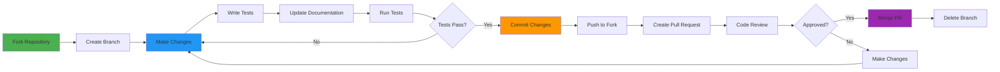

# Contributing

**Contribution Workflow, Guidelines, and Community Standards**

---

## Overview

NeuroScope welcomes contributions from the community! Whether you're fixing a bug, adding a feature, improving documentation, or suggesting new ideas, your contributions are valued. This guide provides everything you need to contribute effectively and responsibly.

### Contribution Philosophy
- **Inclusive**: Welcome contributions of all types and skill levels
- **Quality-Focused**: Maintain high standards for code and documentation
- **Collaborative**: Work together respectfully and constructively
- **Transparent**: Clear communication about changes and decisions

---

## Types of Contributions

### Code Contributions

#### Bug Fixes
- Fix reported issues with existing functionality
- Resolve edge cases and error conditions
- Improve error handling and logging
- Optimize performance bottlenecks

#### Feature Additions
- Add new denoising modes or algorithms
- Implement new model architectures
- Add support for new microscopy modalities
- Enhance web application features
- Improve CLI functionality

#### Documentation
- Improve existing documentation
- Add tutorials and examples
- Translate documentation to other languages
- Fix typos and inconsistencies
- Add diagrams and visual aids

#### Testing
- Add unit tests for uncovered code paths
- Improve test coverage
- Add integration tests
- Add performance benchmarks
- Add end-to-end tests

---

## Getting Started

### First-Time Setup

#### 1. Fork and Clone

```bash
# Fork the repository on GitHub
# Then clone your fork
git clone https://github.com/YOUR_USERNAME/AI-Image-Denoising-In-Microscopy.git
cd AI-Image-Denoising-In-Microscopy
```

#### 2. Set Up Development Environment

```bash
# Create virtual environment
python -m venv .venv
source .venv/bin/activate  # Windows: .venv\Scripts\activate

# Install dependencies
pip install -r requirements.txt
pip install -r requirements_torch.txt

# Install development tools
pip install black flake8 mypy pytest pytest-cov
```

#### 3. Create Feature Branch

```bash
# Create a descriptive branch name
git checkout -b feature/your-feature-name
```

---

## Contribution Workflow

### Development Process



### Step-by-Step Process

#### 1. Identify Contribution Type

**Before starting:**
- Check existing issues for similar contributions
- Search discussions for related conversations
- Consider if the contribution aligns with project goals

#### 2. Create Branch

```bash
# Use descriptive branch names
git checkout -b feature/add-new-model-architecture
git checkout -b fix/memory-leak-in-inference
git checkout -b docs/update-installation-guide
```

#### 3. Make Changes

**Code Changes:**
- Follow the coding standards in [Development Guide](Development-Guide)
- Add appropriate tests
- Update documentation as needed
- Keep changes focused and atomic

**Example Commit Pattern:**
```bash
# Make atomic commits
git add modified_file.py
git commit -m "fix: resolve memory leak in batch processing"

# Make related changes together
git add model_file.py
git add test_file.py
git commit -m "feat: add attention mechanism to model"
```

#### 4. Write Tests

**Test Requirements:**
- Unit tests for new functions
- Integration tests for new features
- Tests should be independent and repeatable
- Aim for meaningful test coverage

**Example Test:**
```python
def test_new_feature():
    """Test new feature functionality."""
    # Setup
    input_data = create_test_data()
    
    # Execute
    result = new_feature(input_data)
    
    # Assert
    assert result is not None
    assert result.shape == expected_shape
    assert quality_metric(result, ground_truth) > threshold
```

#### 5. Update Documentation

**Documentation Updates:**
- Add docstrings to new functions
- Update relevant wiki pages
- Add examples to user guide
- Update API documentation if needed
- Update README.md for user-facing features

#### 6. Run Tests

```bash
# Run all tests
pytest

# Run specific test file
pytest tests/unit/test_new_feature.py

# Run with coverage
pytest --cov=src --cov=services --cov=utils
```

#### 7. Commit Changes

```bash
# Stage changes
git add .

# Commit with descriptive message
git commit -m "feat: add new model architecture with attention mechanism

- Implement self-attention layers in encoder path
- Add position encoding for spatial awareness
- Update training configuration for new model
- Add unit tests for attention mechanism
- Update documentation with new model details

Closes #123"
```

#### 8. Push and Create Pull Request

```bash
# Push to your fork
git push origin feature/add-new-model-architecture

# Create pull request on GitHub
# Provide clear description in PR
```

---

## Pull Request Guidelines

### PR Description Template

Use this template for your pull request:

```markdown
## Description
Brief description of the changes made in this PR.

## Type of Change
- [ ] Bug fix
- [ ] New feature
- [ ] Breaking change
- [ ] Documentation update

## Related Issue
Closes #123

## Changes Made
- Added feature X with implementation details
- Updated function Y to support new parameter
- Added tests for new functionality
- Updated documentation in Z

## Testing
- [ ] Unit tests pass
- [ ] Integration tests pass
- [ ] Manual testing completed
- [ ] Added new tests for new functionality

## Checklist
- [ ] Code follows project style guidelines
- [ ] Self-review completed
- [ ] Comments added for complex code
- [ ] Documentation updated
- [ ] No new warnings generated
- [ ] Tests added/updated
- [ ] All tests passing
```

### PR Best Practices

#### Title
- Use conventional commit format: `feat:`, `fix:`, `docs:`
- Be descriptive but concise
- Example: `feat: add attention mechanism to U-Net architecture`

#### Description
- Explain what the PR does and why
- Link to relevant issues
- Include screenshots for UI changes
- Describe any breaking changes

#### Changes
- List main changes in bullet points
- Be specific about files modified
- Mention configuration changes if any

#### Testing
- Describe how you tested the changes
- List new tests added
- Mention manual testing performed

---

## Code Review Process

### Review Expectations

#### For Contributors
- **Responsive**: Address review feedback promptly
- **Open-minded**: Consider reviewer suggestions
- **Professional**: Maintain respectful communication
- **Patient**: Understand review takes time

#### For Reviewers
- **Constructive**: Provide helpful, actionable feedback
- **Respectful**: Treat contributors professionally
- **Thorough**: Review code, tests, and documentation
- **Timely**: Respond to PRs in reasonable time

### Common Review Feedback

#### Code Quality
- **Style**: Code should follow PEP 8
- **Clarity**: Code should be easy to understand
- **Documentation**: Functions should have docstrings
- **Testing**: Changes should have appropriate tests

#### Functionality
- **Correctness**: Changes should work as intended
- **Edge Cases**: Handle error conditions appropriately
- **Performance**: No significant performance regressions
- **Compatibility**: Maintain backward compatibility when possible

#### Documentation
- **Completeness**: Update all relevant documentation
- **Clarity**: Documentation should be clear and accurate
- **Examples**: Provide usage examples for new features
- **Consistency**: Match existing documentation style

---

## Coding Standards

### Python Style Guide

#### PEP 8 Compliance

```python
# GOOD: Follows PEP 8
def process_image(image_path: str, mode: str = 'auto') -> np.ndarray:
    """
    Process microscopy image with specified denoising mode.
    
    Args:
        image_path: Path to input image
        mode: Denoising mode ('auto', 'unet', 'salt_pepper', 'brightfield')
        
    Returns:
        Denoised image as numpy array
    """
    image = load_image(image_path)
    result = denoise(image, mode=mode)
    return result
```

#### Type Hints

```python
from typing import Optional, Tuple, Dict, List


def process_batch(
    images: List[np.ndarray],
    mode: str = 'auto'
) -> List[np.ndarray]:
    """Process multiple images with type hints."""
    return [process_image(img, mode) for img in images]
```

### Documentation Standards

#### Docstring Format

```python
def advanced_function(
    parameter1: int,
    parameter2: str,
    optional_parameter: Optional[float] = None
) -> Dict[str, any]:
    """
    Brief description of function purpose.
    
    Extended description providing more details about the function's
    behavior, usage, and important notes.
    
    Args:
        parameter1: Description of first parameter
        parameter2: Description of second parameter
        optional_parameter: Description of optional parameter
        
    Returns:
        Dictionary containing:
            - 'metric1': Description of first metric
            - 'metric2': Description of second metric
            
    Raises:
        ValueError: If parameters are invalid
        RuntimeError: If processing fails
        
    Examples:
        >>> result = advanced_function(10, 'test')
        >>> print(result['metric1'])
        42.0
        
    See Also:
        related_function1: Related function description
        related_function2: Another related function
    """
    # Implementation
    pass
```

---

## Testing Standards

### Test Coverage

#### Coverage Goals
- **New Code**: Aim for >80% test coverage
- **Critical Paths**: 100% coverage required
- **Edge Cases**: Test error conditions and edge cases
- **Integration**: Test component interactions

#### Test Structure

```python
class TestNewFeature:
    """Test suite for new feature."""
    
    @pytest.fixture
    def sample_data(self):
        """Provide sample data for testing."""
        return create_sample_data()
    
    def test_basic_functionality(self, sample_data):
        """Test basic functionality."""
        result = new_feature(sample_data)
        assert result is not None
    
    def test_edge_cases(self, sample_data):
        """Test edge cases and error conditions."""
        with pytest.raises(ValueError):
            new_feature(invalid_data)
    
    def test_performance(self, sample_data):
        """Test performance characteristics."""
        start_time = time.time()
        result = new_feature(sample_data)
        elapsed = time.time() - start_time
        assert elapsed < 1.0  # Should complete in < 1 second
```

### Running Tests

```bash
# Run all tests
pytest

# Run with coverage report
pytest --cov=src --cov=services --cov=utils --cov-report=html

# Run specific test file
pytest tests/unit/test_new_feature.py

# Run with verbose output
pytest -v

# Run specific test
pytest tests/unit/test_new_feature.py::TestNewFeature::test_basic_functionality
```

---

## Documentation Standards

### Wiki Documentation

#### Page Organization
- **Navigation**: Cross-link between related pages
- **Consistency**: Use consistent formatting across pages
- **Completeness**: Cover all aspects of the topic
- **Clarity**: Write for your target audience

#### Markdown Best Practices

```markdown
# Use descriptive headings
## Section Name

### Sub-section Name

# Use lists for organized information
- First item
- Second item
- Third item

# Use code blocks with syntax highlighting
```python
def example_function():
    return True
```

# Use tables for structured information
| Column 1 | Column 2 |
|----------|----------|
| Data 1   | Data 2   |

# Use diagrams for visual explanations

```

### Code Comments

#### When to Add Comments

```python
# GOOD: Explain non-obvious implementation
# Using GroupNorm instead of BatchNorm for small-batch stability
# as BatchNorm requires batch size > 1 which isn't always
# possible with memory constraints in microscopy imaging
self.norm = nn.GroupNorm(num_groups=8, num_channels=64)

# GOOD: Document workarounds
# TODO: Replace with more efficient implementation once
# PyTorch supports this operation natively
workaround_result = self._temporary_workaround(input_data)

# BAD: Restate the obvious
# Add one to x
x += 1
```

---

## Issue Reporting

### Before Reporting Issues

#### Check Existing Issues
- Search for similar issues before creating new ones
- Check if the issue is already resolved
- Comment on existing issues if relevant

#### Gather Information

```markdown
## Issue Description
Clear description of the problem

## Environment
- OS: Ubuntu 22.04 / macOS 13.0 / Windows 11
- Python Version: 3.11
- Package Versions: pip list output
- Model: Residual U-Net
- Image Details: Format, size, etc.

## Steps to Reproduce
1. Step one
2. Step two
3. Step three

## Expected Behavior
What should happen

## Actual Behavior
What actually happens

## Error Messages
Exact error messages if any

## Additional Context
Any other relevant information
```

---

## Feature Requests

### Proposing New Features

#### Template for Feature Requests

```markdown
## Feature Description
Clear description of the proposed feature

## Motivation
Why this feature is needed
What problem it solves
Who would benefit

## Proposed Solution
High-level description of the solution
Key implementation details

## Alternatives Considered
Other approaches considered
Why this approach was chosen

## Additional Context
Relevant research papers
Similar implementations
Potential challenges
```

### Feature Request Evaluation

**Consideration Criteria:**
- Alignment with project goals
- User demand and community benefit
- Technical feasibility
- Resource requirements
- Maintenance burden
- Security implications

---

## Community Guidelines

### Code of Conduct

#### Be Respectful
- Treat all community members with respect
- Welcome newcomers and help them learn
- Be patient with questions and learning curves
- Assume good intentions

#### Be Constructive
- Provide constructive, actionable feedback
- Focus on what is best for the project
- Accept feedback graciously
- Collaborate on finding solutions

#### Be Inclusive
- Welcome contributions from all backgrounds
- Consider diverse perspectives
- Make the community welcoming
- Help others participate

#### Be Professional
- Maintain professional communication
- Avoid personal attacks or criticism
- Focus on technical discussions
- Respect different opinions and approaches

---

## Recognition

### Contributor Recognition

#### Acknowledgments
Contributors are recognized for their contributions through:
- GitHub contributor list
- Release notes
- Documentation acknowledgments
- Conference presentations (when applicable)

#### Authorship
For significant contributions:
- Code authors listed in relevant documentation
- Research papers acknowledge contributors
- Technical blog posts feature contributors

---

## Development Resources

### Learning Resources

#### For New Contributors
- [Development Guide](Development-Guide) - Coding standards and workflow
- [Project Architecture](Project-Architecture) - System design
- [API Documentation](API-Documentation) - API reference
- GitHub's [Open Source Guides](https://opensource.guide/)

#### For Advanced Contributors
- Deep learning research papers
- Open source best practices
- Scientific writing guidelines
- Software architecture patterns

---

## Release Process

### Release Cycle

#### Versioning
- **Major Version**: Breaking changes, major new features
- **Minor Version**: New features, backward compatible
- **Patch Version**: Bug fixes, small improvements

#### Release Steps
1. Update version numbers
2. Update CHANGELOG.md
3. Update documentation
4. Create release branch
5. Test release candidate
6. Tag release
7. Create GitHub release
8. Announce to community

---

## Contact and Communication

### Communication Channels

#### Official Channels
- **GitHub Issues**: Bug reports and feature requests
- **GitHub Discussions**: Questions and community discussion
- **Pull Requests**: Code contributions and reviews

#### Response Time Expectations
- **Issues**: Aim for response within 1-2 weeks
- **Pull Requests**: Initial review within 1 week
- **Questions**: Community may respond within a few days

---

## License and Rights

### Contribution Rights

By contributing to NeuroScope, you agree that:
- Your contributions will be licensed under the project's MIT License
- Your contributions may be included in future releases
- Your contributions will be properly attributed
- You retain copyright to your contributions

### Third-Party Code

When adding third-party code or libraries:
- Ensure compatible license (MIT preferred)
- Add attribution in code comments
- Update license file if needed
- Document dependencies in requirements files

---

## Tools and Resources

### Development Tools

#### Essential Tools
- **Git**: Version control
- **GitHub**: Issue tracking and collaboration
- **pytest**: Testing framework
- **black**: Code formatting
- **flake8**: Code linting

#### Optional Tools
- **mypy**: Static type checking
- **pre-commit**: Git hooks for quality
- **tox**: Automated testing across Python versions

### Learning Resources

#### Open Source Contribution
- [GitHub Flow](https://guides.github.com/introduction/flow/) - GitHub workflow
- [Open Source Guides](https://opensource.guide/) - Open source best practices
- [How to Contribute to Open Source](https://opensource.guide/how-to-contribute/) - Contribution guide

#### Python Development
- [PEP 8 Style Guide](https://pep8.org/) - Python style
- [Python Type Hints](https://docs.python.org/3/library/typing.html) - Type hints
- [pytest Documentation](https://docs.pytest.org/) - Testing framework

---

## Getting Help

### When You're Stuck

#### First Steps
1. Check documentation (wiki, README)
2. Search existing issues and discussions
3. Ask in GitHub Discussions
4. Create an issue if needed

#### Asking Questions
- Be specific about what you're trying to do
- Provide context about your environment
- Share error messages or symptoms
- Describe what you've already tried

---

## Special Contribution Programs

### Outreach Programs

#### Academic Contribution
Students and researchers are welcome to contribute as part of:
- Course projects
- Thesis work
- Research collaborations
- Open source class projects

#### Mentorship
- Available for new contributors
- Focus on first-time open source contributors
- Guidance on contribution process
- Code review and feedback

---

## Acknowledgments

### Contributor Recognition

The NeuroScope project gratefully acknowledges all contributors who:
- Report bugs and issues
- Submit pull requests
- Improve documentation
- Answer questions in discussions
- Test and validate features
- Share their experiences

Every contribution, no matter how small, helps improve the project for everyone.

---

<div align="center">

**Community contributions are the foundation of open source success**

[⬆ Back to Wiki Home](Home) | [← FAQ](FAQ) |

</div>
