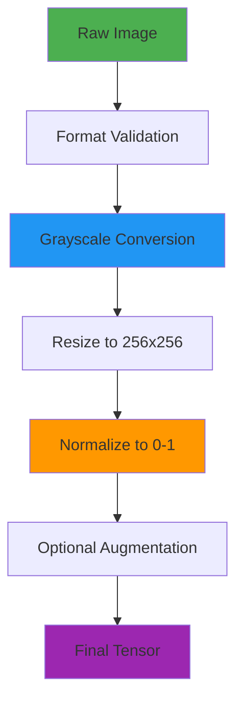
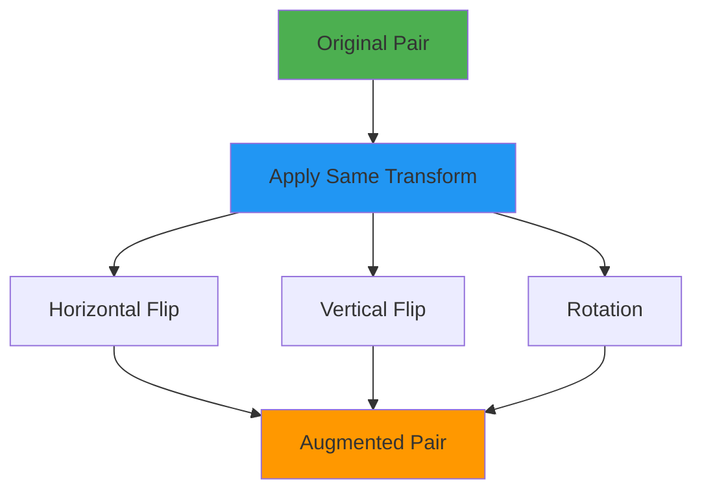
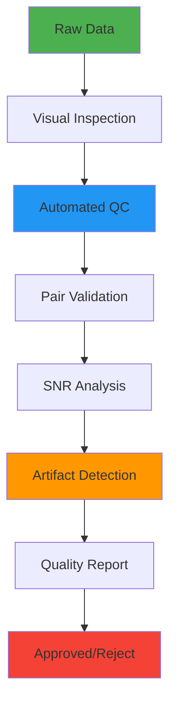
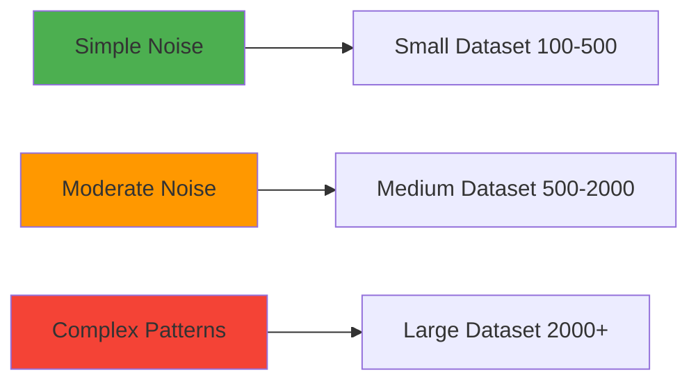

# Dataset Documentation

**Data Sources, Preprocessing, and Quality Considerations**

---

## Overview

NeuroScope uses paired noisy/clean microscopy images for training, following the CARE (Content-Aware Image Restoration) methodology. The dataset structure enables supervised learning where the network learns to map noisy microscopy images to their clean, high-SNR counterparts.

### Dataset Philosophy
- **Paired Learning**: Requires exact correspondence between noisy and clean images
- **Modality-Specific**: Optimized for fluorescence microscopy but adaptable to other modalities
- **Quality-First**: Emphasizes data quality over quantity for better generalization
- **Reproducible**: Standardized preprocessing ensures consistent training

---

## Dataset Sources

### Recommended Data Sources

#### 1. Public Microscopy Datasets
- **CARE Dataset**: Original CARE framework datasets for fluorescence microscopy
- **ISBI Challenge**: 2D EM segmentation challenge datasets
- **BioImage Archive**: Curated biological image datasets
- **Cell Tracking Challenge**: Live cell microscopy time-lapse data

#### 2. Synthetic Data Generation
- **Noise Simulation**: Add realistic noise to clean microscopy images
- **Monte Carlo Methods**: Simulate photon counting statistics
- **Point Spread Function**: Apply realistic optical blur to clean images
- **Augmentation**: Generate additional samples through controlled transformations

#### 3. Custom Data Collection
- **Microscope Settings**: Paired acquisitions at different exposure times
- **Sample Preparation**: Optimized sample preparation for clean references
- **Calibration Standards**: Use standardized samples for validation

### Data Requirements

#### Image Specifications
| Parameter | Requirement | Notes |
|-----------|-------------|-------|
| **Format** | PNG, TIFF, JPEG | Lossless formats preferred |
| **Bit Depth** | 8-bit or 16-bit | Automatic normalization applied |
| **Dimensions** | Variable (resized to 256×256) | Original aspect ratio preserved in output |
| **Color Space** | Grayscale preferred | Auto-converted from RGB if needed |
| **File Size** | < 50MB per image | Configurable limit |

#### Pairing Requirements
- **Exact Correspondence**: Noisy and clean images must be spatially aligned
- **Filename Matching**: Same basename for noisy/clean pairs
- **Temporal Consistency**: For time-series, maintain temporal alignment
- **Quality Difference**: Significant SNR improvement in clean images

---

## Dataset Structure

### Directory Organization

```
data/
└── train/
    ├── noisy/                # Noisy microscopy images
    │   ├── cell_001.png
    │   ├── cell_002.png
    │   └── ...
    └── clean/                # Clean ground-truth images
        ├── cell_001.png
        ├── cell_002.png
        └── ...
```

### Naming Conventions

#### Standard Naming
```
noisy/cell_001.png  ↔  clean/cell_001.png
noisy/tissue_023.tif ↔ clean/tissue_023.tif
```

#### Supported Patterns
- **Sequential**: `sample_001`, `sample_002`, ...
- **Descriptive**: `cell_membrane_01`, `nucleus_02`, ...
- **Timestamp**: `image_20240101_120000`, ...
- **Custom**: Any consistent naming scheme

#### File Extensions
- **Images**: `.png`, `.jpg`, `.jpeg`, `.tif`, `.tiff`, `.bmp`
- **Case-Insensitive**: Both `.png` and `.PNG` supported
- **Mixed Extensions**: Different extensions allowed for noisy/clean pairs

---

## Data Preprocessing

### Preprocessing Pipeline



### Preprocessing Steps

#### 1. Format Validation
- **File Type Check**: Verify supported image formats
- **Corruption Detection**: Check for file corruption
- **Size Validation**: Ensure minimum resolution (32×32 pixels)
- **Memory Limits**: Enforce maximum file size limits

#### 2. Grayscale Conversion
```python
# Automatic grayscale conversion logic
if image.ndim == 3:
    if channels_equal(image):
        image = image[:, :, 0]  # Extract single channel
    else:
        image = rgb_to_grayscale(image)  # Convert to grayscale
```

#### 3. Image Resizing
- **Target Size**: 256×256 pixels (configurable)
- **Interpolation**: INTER_AREA for downsampling
- **Aspect Ratio**: Can be preserved if needed
- **Quality**: High-quality interpolation to prevent artifacts

#### 4. Normalization
```python
# Normalization logic
if image.max() <= 1.0:
    normalized_image = clip(image, 0.0, 1.0)
elif image.max() > 255.0:
    normalized_image = image / 65535.0  # 16-bit data
else:
    normalized_image = image / 255.0   # 8-bit data
```

#### 5. Data Type Conversion
- **Input**: uint8, uint16, float32
- **Output**: float32 normalized [0, 1]
- **Memory**: Efficient float32 representation
- **Precision**: Sufficient for deep learning training

---

## Data Augmentation

### Augmentation Strategy



### Augmentation Techniques

#### 1. Geometric Transformations
- **Horizontal Flip**: 50% probability
- **Vertical Flip**: 50% probability
- **Rotation**: 90°, 180°, 270° (25% probability each)
- **Combined**: Multiple transforms can be applied

#### 2. Synchronized Application
```python
# Critical: Apply same transform to both noisy and clean
transform_ops = (
    horizontal_flip,   # Same for both images
    vertical_flip,     # Same for both images
    rotation_k,        # Same rotation for both
)

noisy_aug = apply_transform(noisy, transform_ops)
clean_aug = apply_transform(clean, transform_ops)
```

#### 3. Advanced Augmentation (Optional)
- **Elastic Deformations**: Simulate tissue deformation
- **Intensity Variations**: Random brightness/contrast changes
- **Gaussian Noise**: Additional controlled noise injection
- **Blur Variations**: Simulate focus variations

### Augmentation Configuration

```python
# Enable augmentation in training
dataset = CAREDatasetSimple(
    root_dir="data",
    augment=True,  # Enable augmentation
    image_size=(256, 256),
    normalize=True
)
```

---

## Data Quality Considerations

### Quality Assessment Metrics

#### 1. SNR Calculation
```python
def calculate_snr(noisy, clean):
    signal_power = np.var(clean)
    noise_power = np.var(noisy - clean)
    snr = 10 * np.log10(signal_power / noise_power)
    return snr
```

#### 2. Pair Quality Metrics
- **Spatial Correlation**: Verify alignment between pairs
- **Intensity Distribution**: Check for realistic intensity ranges
- **Artifacts Detection**: Identify processing artifacts
- **Resolution Consistency**: Ensure matching resolutions

#### 3. Dataset Statistics
- **Image Count**: Number of paired samples
- **Resolution Range**: Min/max image dimensions
- **Intensity Range**: Pixel value distribution
- **SNR Distribution**: Quality distribution across dataset

### Quality Control Workflow



### Common Issues & Solutions

| Issue | Symptoms | Solution |
|-------|----------|----------|
| **Misaligned Pairs** | Poor denoising results | Re-align images using registration |
| **Insufficient Noise** | Overfitting to clean images | Add controlled noise to clean images |
| **Over-Smoothed Clean** | Loss of fine details | Use higher quality clean references |
| **Color Casts** | Incorrect grayscale conversion | Proper RGB to grayscale conversion |
| **Compression Artifacts** | Training instability | Use lossless compression formats |

---

## Dataset Processing Pipeline

### Automated Dataset Processing

#### Script Usage
```bash
python scripts/process_microscopy_dataset.py \
  --input_dir /path/to/CARE_dataset \
  --output_dir data \
  --image_size 256 \
  --normalize
```

#### Processing Steps
1. **Source Validation**: Verify source directory structure
2. **Pair Matching**: Match noisy/clean image pairs
3. **Quality Check**: Validate image quality and correspondence
4. **Preprocessing**: Apply standard preprocessing pipeline
5. **Statistics**: Generate dataset statistics report
6. **Output**: Save processed dataset in CARE format

### Dataset Statistics Report

```python
# Example statistics output
Dataset Statistics:
- Total pairs: 1,234
- Average resolution: 512x512
- SNR range: 5.2 - 18.7 dB
- Unmatched files: 12
- Format distribution: PNG: 80%, TIFF: 20%
```

---

## Training/Validation Split

### Split Strategy

#### Standard Split
```python
# Default split used in training
train_split = 0.8
val_split = 0.2

dataset_size = len(full_dataset)
val_size = int(val_split * dataset_size)
train_size = dataset_size - val_size
```

#### Stratified Split (Recommended)
```python
# Stratified by SNR or image characteristics
from sklearn.model_selection import train_test_split

indices = np.arange(len(full_dataset))
snr_values = [calculate_snr(pair) for pair in full_dataset]

train_idx, val_idx = train_test_split(
    indices,
    test_size=0.2,
    stratify=snr_bins  # Stratify by SNR
)
```

### Cross-Validation (Optional)
- **K-Fold CV**: 5-fold cross-validation for robust evaluation
- **Leave-One-Out**: For small datasets (< 100 pairs)
- **Time-Series Split**: For temporal data with temporal correlation

---

## Dataset Requirements by Model

### Minimum Dataset Requirements

| Model Type | Minimum Pairs | Recommended Pairs | Notes |
|------------|--------------|------------------|-------|
| **Standard U-Net** | 100 | 1,000+ | Good for simple noise patterns |
| **Enhanced U-Net** | 200 | 2,000+ | Requires more data for residual blocks |
| **Residual U-Net** | 500 | 5,000+ | Deepest architecture needs most data |

### Data Complexity vs. Dataset Size



---

## Dataset Best Practices

### Data Collection
- **Consistent Acquisition**: Use same microscope settings when possible
- **Quality Over Quantity**: Better to have fewer high-quality pairs
- **Diversity**: Include various cell types, staining conditions, noise levels
- **Documentation**: Record acquisition parameters for reproducibility

### Data Organization
- **Clear Naming**: Use descriptive, consistent naming conventions
- **Version Control**: Track dataset versions and changes
- **Backup**: Maintain backups of original raw data
- **Metadata**: Include acquisition parameters in metadata files

### Quality Assurance
- **Visual Inspection**: Manually review sample pairs
- **Automated QC**: Implement automated quality checks
- **Validation**: Hold out validation set from training
- **Testing**: Maintain separate test set for final evaluation

---

## Troubleshooting Dataset Issues

### Common Problems

#### 1. No Matching Pairs Found
**Symptoms**: Dataset loader reports "No matching image pairs found"

**Solutions**:
- Verify directory structure matches CARE format
- Check filename matching (case-sensitive)
- Ensure file extensions are supported
- Check for hidden characters in filenames

#### 2. Poor Training Performance
**Symptoms**: Model fails to learn or overfits

**Solutions**:
- Verify clean images are actually cleaner than noisy
- Check SNR of training pairs
- Increase dataset size
- Improve data quality
- Adjust augmentation strategy

#### 3. Memory Issues During Loading
**Symptoms**: Out-of-memory errors during training

**Solutions**:
- Reduce batch size
- Use smaller image sizes
- Enable memory-efficient loading
- Use data generators instead of pre-loading

#### 4. Inconsistent Preprocessing
**Symptoms**: Different results between training and inference

**Solutions**:
- Ensure identical preprocessing pipelines
- Use shared preprocessing utilities
- Verify normalization consistency
- Check image resize behavior

---

## Dataset Tools and Utilities

### Built-in Dataset Tools

#### 1. Dataset Validation
```python
from src.care_dataset_simple import CAREDatasetSimple

dataset = CAREDatasetSimple(root_dir="data")
print(f"Loaded {len(dataset)} image pairs")
```

#### 2. Dataset Inspection
```python
# Inspect first sample
noisy, clean = dataset[0]
print(f"Noisy shape: {noisy.shape}")
print(f"Clean shape: {clean.shape}")
print(f"Value range: [{noisy.min():.3f}, {noisy.max():.3f}]")
```

#### 3. Statistics Generation
```bash
python scripts/process_microscopy_dataset.py \
  --input_dir data \
  --output_dir processed_data \
  --generate_stats
```

---

<div align="center">

**Quality data is the foundation of effective AI denoising**

[⬆ Back to Wiki Home](Home) | [← Project Architecture](Project-Architecture) | [Model Documentation](Model-Documentation) →

</div>
