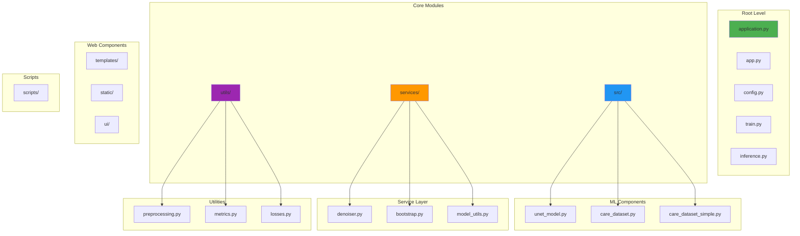
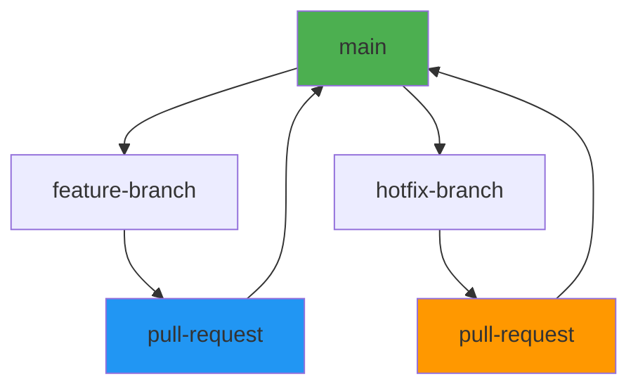
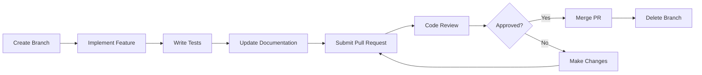

# Development Guide

**Project Structure, Coding Standards, and Development Workflow**

---

## Overview

This comprehensive development guide provides everything needed to contribute to FluoClean AI, including project structure, coding standards, development workflow, and best practices. Whether you're fixing a bug, adding a feature, or contributing documentation, this guide will help you work effectively with the codebase.

### Development Philosophy
- **Modularity**: Clean separation of concerns
- **Maintainability**: Code that's easy to understand and modify
- **Performance**: Efficient without premature optimization
- **Testing**: Comprehensive testing for reliability
- **Documentation**: Clear code comments and docstrings

---

## Project Structure

### Directory Organization



### Key Directories and Files

#### Core Application Files

| File/Directory | Purpose | Key Contents |
|----------------|---------|--------------|
| **application.py** | Flask production app | REST API, request handling |
| **app.py** | Streamlit UI prototype | Interactive interface |
| **config.py** | Configuration management | Environment variables, settings |
| **train.py** | Training script | Model training pipeline |
| **inference.py** | CLI inference tool | Command-line processing |

#### Source Modules

| Directory | Purpose | Key Files |
|-----------|---------|-----------|
| **src/** | Deep learning models | unet_model.py, care_dataset.py |
| **services/** | Application services | denoiser.py, bootstrap.py |
| **utils/** | Shared utilities | preprocessing.py, metrics.py |

#### Web Components

| Directory | Purpose | Key Files |
|-----------|---------|-----------|
| **templates/** | HTML templates | index.html |
| **static/** | CSS/JS assets | css/app.css, js/app.js |
| **ui/** | Streamlit components | components.py, run_layout.py |

#### Scripts

| Directory | Purpose | Key Scripts |
|-----------|---------|-------------|
| **scripts/** | Utility scripts | export_inference_checkpoint.py |

---

## Coding Standards

### Python Style Guide

#### Code Formatting
- **Style**: PEP 8 compliant
- **Line Length**: Maximum 100 characters
- **Indentation**: 4 spaces (no tabs)
- **Imports**: Organized and grouped
- **Naming**: snake_case for variables/functions, PascalCase for classes

#### Example Code Structure

```python
"""
Module docstring explaining the module's purpose.

This module provides functionality for X with support for Y.
"""

from __future__ import annotations

import numpy as np
from typing import Optional, Tuple


class ExampleClass:
    """Class docstring describing purpose and usage."""
    
    def __init__(self, param1: str, param2: Optional[int] = None):
        """
        Initialize the ExampleClass.
        
        Args:
            param1: Description of param1
            param2: Description of param2 (optional)
        """
        self.param1 = param1
        self.param2 = param2 or 0
    
    def example_method(self, input_data: np.ndarray) -> Tuple[float, float]:
        """
        Method docstring describing functionality.
        
        Args:
            input_data: Input array for processing
            
        Returns:
            Tuple of (metric1, metric2)
        """
        # Implementation
        result = input_data.mean(), input_data.std()
        return result


def example_function(value: int, multiplier: float = 1.0) -> float:
    """
    Function docstring explaining purpose and parameters.
    
    Args:
        value: Input integer value
        multiplier: Multiplier for calculation
        
    Returns:
        Calculated result
    """
    return value * multiplier


if __name__ == "__main__":
    # Example usage
    instance = ExampleClass("test", 5)
    print(instance.example_method(np.array([1, 2, 3])))
```

#### Type Hints

**Why Use Type Hints:**
- **Documentation**: Self-documenting code
- **IDE Support**: Better autocomplete and error checking
- **Refactoring**: Safer code changes
- **Quality**: Catch type errors early

**Examples:**
```python
from typing import Optional, Tuple, Dict, List, Union


def process_data(
    data: np.ndarray,
    threshold: float,
    options: Optional[Dict[str, any]] = None
) -> Tuple[np.ndarray, Dict[str, float]]:
    """
    Process data with type hints.
    """
    if options is None:
        options = {}
    
    processed = data > threshold
    metrics = {'mean': processed.mean(), 'std': processed.std()}
    return processed, metrics
```

### Documentation Standards

#### Docstring Format

Use Google-style docstrings:

```python
def calculate_metrics(predictions: np.ndarray, targets: np.ndarray) -> Dict[str, float]:
    """
    Calculate evaluation metrics for model performance.
    
    This function computes PSNR, SSIM, and MAE metrics between
    predictions and ground truth targets.
    
    Args:
        predictions: Model predictions (numpy array)
        targets: Ground truth targets (numpy array)
        
    Returns:
        Dictionary containing metric names and values:
            - 'psnr': Peak Signal-to-Noise Ratio in dB
            - 'ssim': Structural Similarity Index
            - 'mae': Mean Absolute Error
            
    Raises:
        ValueError: If predictions and targets have different shapes
        
    Examples:
        >>> preds = np.random.rand(10, 256, 256)
        >>> targets = np.random.rand(10, 256, 256)
        >>> metrics = calculate_metrics(preds, targets)
        >>> print(f"PSNR: {metrics['psnr']:.2f}")
    """
    if predictions.shape != targets.shape:
        raise ValueError("Predictions and targets must have same shape")
    
    # Implementation
    psnr = calculate_psnr(predictions, targets)
    ssim = calculate_ssim(predictions, targets)
    mae = calculate_mae(predictions, targets)
    
    return {'psnr': psnr, 'ssim': ssim, 'mae': mae}
```

#### Comments

**When to Use Comments:**
- **Complex Logic**: Explain non-obvious algorithms
- **Workarounds**: Document why unusual approaches were taken
- **Future Work**: Mark areas for future improvement
- **Bug Notes**: Document known issues and workarounds

**Comment Examples:**
```python
# GOOD: Explains the "why"
# Using GroupNorm instead of BatchNorm for small-batch stability
# BatchNorm requires batch size > 1, which isn't always possible
# with memory constraints in microscopy imaging
self.norm = nn.GroupNorm(num_groups=8, num_channels=64)

# GOOD: Documents workaround
# TODO: Replace with more efficient implementation once ONNX support improves
# This is a temporary workaround for ONNX export limitations
temp_result = self._workaround_function(input)

# BAD: Restates the obvious
# Increment the counter by 1
count += 1
```

### Error Handling

#### Exception Handling Guidelines

```python
from typing import Optional


def safe_process(data: np.ndarray) -> Optional[np.ndarray]:
    """
    Safely process data with comprehensive error handling.
    
    Returns:
        Processed data or None if processing fails
    """
    try:
        # Validate input
        if data is None:
            raise ValueError("Input data cannot be None")
        
        if not isinstance(data, np.ndarray):
            raise TypeError(f"Expected numpy array, got {type(data)}")
        
        # Process data
        result = process_data(data)
        
        return result
        
    except ValueError as e:
        logger.error(f"Validation error: {e}")
        return None
        
    except Exception as e:
        logger.exception(f"Unexpected error during processing: {e}")
        return None
```

#### Custom Exceptions

```python
class DenoisingError(Exception):
    """Base exception for denoising-related errors."""
    pass


class ModelNotReadyError(DenoisingError):
    """Raised when the model is not ready for inference."""
    pass


class ImageProcessingError(DenoisingError):
    """Raised when image processing fails."""
    pass


# Usage
def run_inference(model, image):
    if not model.is_loaded:
        raise ModelNotReadyError("Model must be loaded before inference")
    
    try:
        result = model.process(image)
    except Exception as e:
        raise ImageProcessingError(f"Failed to process image: {e}")
```

---

## Development Workflow

### Setup Development Environment

#### 1. Clone and Install

```bash
# Clone repository
git clone https://github.com/Sam-wan30/AI-Image-Denoising-In-Microscopy.git
cd AI-Image-Denoising-In-Microscopy

# Create virtual environment
python -m venv .venv
source .venv/bin/activate  # Windows: .venv\Scripts\activate

# Install dependencies
pip install -r requirements.txt
pip install -r requirements_torch.txt  # For training

# Install development dependencies
pip install black flake8 mypy pytest pytest-cov
```

#### 2. Development Tools Configuration

**Black (Code Formatting):**
```bash
# Create pyproject.toml
[tool.black]
line-length = 100
target-version = ['py311']
include = '\.pyi?$'
exclude = '''
/(
    \.git
  | \.venv
  | build
  | dist
)/
'''

# Format code
black .
```

**Flake8 (Linting):**
```bash
# Create setup.cfg
[flake8]
max-line-length = 100
extend-ignore = E203, W503
exclude = .git,__pycache__,build,dist

# Run linting
flake8 .
```

**MyPy (Type Checking):**
```bash
# Create mypy.ini
[mypy]
python_version = 3.11
warn_return_any = True
warn_unused_configs = True
disallow_untyped_defs = False

# Run type checking
mypy .
```

### Git Workflow

#### Branch Strategy



#### Branch Naming Convention

- **Feature branches**: `feature/description-of-feature`
- **Bugfix branches**: `bugfix/description-of-bug`
- **Hotfix branches**: `hotfix/urgent-fix-description`
- **Documentation**: `docs/description-of-docs`

#### Development Workflow

```bash
# 1. Create feature branch
git checkout -b feature/add-new-model-architecture

# 2. Make changes
# ... work on code ...

# 3. Stage and commit
git add .
git commit -m "Add new model architecture with attention mechanism"

# 4. Push to remote
git push origin feature/add-new-model-architecture

# 5. Create pull request
# Go to GitHub and create PR

# 6. After merge, delete branch
git checkout main
git pull origin main
git branch -d feature/add-new-model-architecture
git push origin --delete feature/add-new-model-architecture
```

### Commit Message Convention

#### Format

```
<type>(<scope>): <subject>

<body>

<footer>
```

#### Types

- **feat**: New feature
- **fix**: Bug fix
- **docs**: Documentation changes
- **style**: Code style changes (formatting)
- **refactor**: Code refactoring
- **test**: Adding or updating tests
- **chore**: Maintenance tasks

#### Examples

```
feat(model): add residual U-Net architecture

- Implement ResidualMicroscopyUNet class
- Add residual blocks to encoder path
- Update model creation factory
- Add training configuration for new model

Closes #123

fix(inference): resolve memory leak in batch processing

Memory leak occurred when processing large batches due to
accumulated intermediate results. Added explicit cleanup
in the processing loop.

Fixes #456

docs(readme): update installation instructions

- Add Docker installation steps
- Update Python version requirements
- Add troubleshooting section

docs-api: update API documentation

api: add rate limiting support

- Implement rate limiting using Flask-Limiter
- Add rate limit headers
- Update API documentation

style: format code with black

Run black on all Python files to ensure consistent formatting.
```

---

## Testing

### Test Structure

```
tests/
├── unit/
│   ├── test_preprocessing.py
│   ├── test_metrics.py
│   └── test_losses.py
├── integration/
│   ├── test_training_pipeline.py
│   ├── test_inference_pipeline.py
│   └── test_api_endpoints.py
└── fixtures/
    ├── test_data/
    └── test_models/
```

### Writing Tests

#### Unit Tests

```python
import pytest
import numpy as np
from utils.metrics import calculate_psnr, calculate_ssim


class TestMetrics:
    """Test suite for metrics calculation."""
    
    def test_psnr_identical_images(self):
        """Test PSNR returns infinity for identical images."""
        image = np.random.rand(10, 256, 256)
        psnr = calculate_psnr(image, image)
        assert psnr == float('inf')
    
    def test_psnr_different_images(self):
        """Test PSNR returns finite value for different images."""
        image1 = np.random.rand(10, 256, 256)
        image2 = image1 + 0.1  # Add noise
        psnr = calculate_psnr(image1, image2)
        assert 20 < psnr < 40  # Reasonable range
    
    def test_ssim_identical_images(self):
        """Test SSIM returns 1.0 for identical images."""
        image = np.random.rand(10, 256, 256)
        ssim = calculate_ssim(image, image)
        assert ssim == 1.0
    
    def test_ssim_different_images(self):
        """Test SSIM returns value between 0 and 1 for different images."""
        image1 = np.random.rand(10, 256, 256)
        image2 = image1 + 0.1
        ssim = calculate_ssim(image1, image2)
        assert 0 < ssim < 1
```

#### Integration Tests

```python
import pytest
import tempfile
from pathlib import Path
from train import train_model
from src.unet_model import create_unet_model


class TestTrainingPipeline:
    """Test suite for training pipeline integration."""
    
    def test_training_with_small_dataset(self):
        """Test training with minimal dataset."""
        with tempfile.TemporaryDirectory() as temp_dir:
            # Create minimal dataset
            data_dir = Path(temp_dir) / "data"
            data_dir.mkdir()
            
            # Add training logic
            # This would require dataset creation
            
            # Run training
            model = create_unet_model(model_type='standard')
            # Train for 1 epoch
            # Verify convergence
            assert True  # Placeholder assertion
    
    def test_model_checkpoint_saving(self):
        """Test model checkpoints are saved correctly."""
        with tempfile.TemporaryDirectory() as temp_dir:
            save_dir = Path(temp_dir) / "models"
            save_dir.mkdir()
            
            # Create and save model
            model = create_unet_model()
            checkpoint_path = save_dir / "test_checkpoint.pth"
            
            # Save checkpoint
            torch.save({
                'model_state_dict': model.state_dict(),
                'model_type': 'standard'
            }, checkpoint_path)
            
            # Verify file exists
            assert checkpoint_path.exists()
            
            # Verify can be loaded
            loaded_checkpoint = torch.load(checkpoint_path)
            assert 'model_state_dict' in loaded_checkpoint
```

### Running Tests

```bash
# Run all tests
pytest

# Run specific test file
pytest tests/unit/test_metrics.py

# Run with coverage
pytest --cov=src --cov=services --cov=utils

# Run with verbose output
pytest -v

# Run specific test
pytest tests/unit/test_metrics.py::TestMetrics::test_psnr_identical_images
```

---

## Adding New Features

### Feature Development Workflow

#### 1. Planning

```markdown
## Feature: [Feature Name]

### Problem
[Description of the problem this feature solves]

### Proposed Solution
[Description of the proposed solution]

### Implementation Plan
- [ ] Task 1
- [ ] Task 2
- [ ] Task 3

### Testing Strategy
- [ ] Unit tests
- [ ] Integration tests
- [ ] Manual testing

### Documentation
- [ ] Update code documentation
- [ ] Update user guide
- [ ] Update API documentation
```

#### 2. Implementation Steps

```python
# Example: Adding a new denoising mode

# Step 1: Add mode to config.py
DENOISING_MODES = ['auto', 'unet', 'salt_pepper', 'brightfield', 'new_mode']

# Step 2: Implement mode in denoiser.py
def new_mode_denoise(image):
    """Implementation of new denoising mode"""
    # Implementation
    return denoised_image

# Step 3: Add mode selection in application.py
@app.route('/api/denoise', methods=['POST'])
def api_denoise():
    mode = request.form.get('mode', 'auto')
    if mode == 'new_mode':
        result = new_mode_denoise(image)
    # ... existing logic

# Step 4: Add tests
def test_new_mode():
    # Test implementation
    assert True
```

#### 3. Documentation Updates

- Update relevant wiki pages
- Add API documentation if needed
- Update examples in user guide
- Add docstrings to new code

---

## Code Review Process

### Review Checklist

#### Code Quality
- [ ] Code follows PEP 8 style guidelines
- [ ] Type hints are used appropriately
- [ ] Docstrings are complete and accurate
- [ ] No hardcoded values (use configuration)
- [ ] Error handling is comprehensive

#### Functionality
- [ ] Feature works as intended
- [ ] Edge cases are handled
- [ ] Performance is acceptable
- [ ] No memory leaks
- [ ] Thread-safe if applicable

#### Testing
- [ ] Unit tests are included
- [ ] Tests cover edge cases
- [ ] Integration tests are updated
- [ ] Tests pass successfully

#### Documentation
- [ ] Code is well-documented
- [ ] API docs are updated
- [ ] User guide is updated
- [ ] Examples are provided

### Pull Request Process



---

## Performance Optimization

### Profiling

```python
import cProfile
import pstats

def profile_function(func):
    """Decorator for profiling function performance."""
    def wrapper(*args, **kwargs):
        profiler = cProfile.Profile()
        profiler.enable()
        result = func(*args, **kwargs)
        profiler.disable()
        
        stats = pstats.Stats(profiler)
        stats.sort_stats('cumulative')
        stats.print_stats(10)  # Print top 10 functions
        
        return result
    return wrapper


@profile_function
def expensive_function(data):
    """Profile this function's performance."""
    # Implementation
    return processed_data
```

### Memory Profiling

```python
import tracemalloc

def profile_memory(func):
    """Decorator for profiling memory usage."""
    def wrapper(*args, **kwargs):
        tracemalloc.start()
        
        result = func(*args, **kwargs)
        
        snapshot = tracemalloc.take_snapshot()
        top_stats = snapshot.statistics('lineno')
        
        for stat in top_stats[:10]:
            print(stat)
        
        return result
    return wrapper
```

---

## Debugging

### Debugging Tips

#### Logging

```python
import logging

# Configure logging
logging.basicConfig(
    level=logging.INFO,
    format='%(asctime)s - %(name)s - %(levelname)s - %(message)s'
)

logger = logging.getLogger(__name__)

# Use logging in code
def process_data(data):
    logger.info(f"Processing data with shape {data.shape}")
    
    try:
        result = complex_operation(data)
        logger.info("Processing completed successfully")
        return result
    except Exception as e:
        logger.error(f"Processing failed: {e}", exc_info=True)
        raise
```

#### pdb Debugging

```python
import pdb

def debug_function(data):
    # Set breakpoint
    pdb.set_trace()
    
    # Debugging steps
    processed = data * 2
    return processed

# Alternative: use breakpoint() in Python 3.7+
def modern_debug_function(data):
    breakpoint()  # Built-in breakpoint
    return data * 2
```

---

## Best Practices

### Performance

#### Memory Efficiency

```python
# GOOD: Use generators for large datasets
def process_large_dataset(data_dir):
    """Process large dataset without loading all into memory."""
    for image_path in Path(data_dir).glob('*.png'):
        image = load_image(image_path)
        yield process_image(image)

# BAD: Load entire dataset into memory
def process_large_dataset_bad(data_dir):
    """Inefficient: loads all images into memory."""
    images = [load_image(p) for p in Path(data_dir).glob('*.png')]
    return [process_image(img) for img in images]
```

#### CPU/GPU Optimization

```python
# GOOD: Use appropriate device
device = 'cuda' if torch.cuda.is_available() else 'cpu'
model = model.to(device)

# BAD: Always assume CUDA
model = model.to('cuda')  # Will fail if CUDA not available
```

### Security

#### Input Validation

```python
def safe_process_file(file_path):
    """Safely process file with validation."""
    # Validate file path
    file_path = Path(file_path).resolve()
    
    # Check file exists
    if not file_path.exists():
        raise FileNotFoundError(f"File not found: {file_path}")
    
    # Check file is within allowed directory
    allowed_dir = Path('/safe/directory').resolve()
    if not str(file_path).startswith(str(allowed_dir)):
        raise ValueError("File path outside allowed directory")
    
    # Check file extension
    if file_path.suffix not in ['.png', '.jpg', '.tiff']:
        raise ValueError(f"Unsupported file type: {file_path.suffix}")
    
    # Process file
    return process_file(file_path)
```

---

## Continuous Integration

### GitHub Actions (Future)

```yaml
# .github/workflows/test.yml
name: Test

on: [push, pull_request]

jobs:
  test:
    runs-on: ubuntu-latest
    
    steps:
    - uses: actions/checkout@v2
    
    - name: Set up Python
      uses: actions/setup-python@v2
      with:
        python-version: '3.11'
    
    - name: Install dependencies
      run: |
        pip install -r requirements.txt
        pip install pytest pytest-cov black flake8
    
    - name: Run linting
      run: flake8 .
    
    - name: Run formatting check
      run: black --check .
    
    - name: Run tests
      run: pytest --cov=src --cov=services --cov=utils
    
    - name: Upload coverage
      uses: codecov/codecov-action@v2
```

---

## Development Tips

### IDE Configuration

#### VS Code Settings

```json
{
  "python.defaultInterpreterPath": ".venv/bin/python",
  "python.formatting.provider": "black",
  "python.linting.enabled": true,
  "python.linting.flake8Enabled": true,
  "python.linting.mypyEnabled": true,
  "editor.formatOnSave": true,
  "editor.rulers": [100]
}
```

### Virtual Environment Management

```bash
# Create environment with specific Python version
python3.11 -m venv .venv

# Activate environment
source .venv/bin/activate

# Freeze requirements
pip freeze > requirements.txt

# Install from requirements
pip install -r requirements.txt

# Deactivate
deactivate
```

---

## Troubleshooting Development Issues

### Common Issues

#### Import Errors

**Problem**: Module not found errors

**Solutions**:
```bash
# Ensure virtual environment is activated
source .venv/bin/activate

# Install dependencies
pip install -r requirements.txt

# Check Python path
python -c "import sys; print(sys.path)"

# Reinstall package
pip uninstall package-name
pip install package-name
```

#### Test Failures

**Problem**: Tests failing in CI but passing locally

**Solutions**:
- Check Python version compatibility
- Verify dependency versions
- Check environment variables
- Review test isolation

---

<div align="center">

**Following development standards ensures high-quality, maintainable code**

[⬆ Back to Wiki Home](Home) | [← Research Background](Research-Background) | [Roadmap](Roadmap) →

</div>
