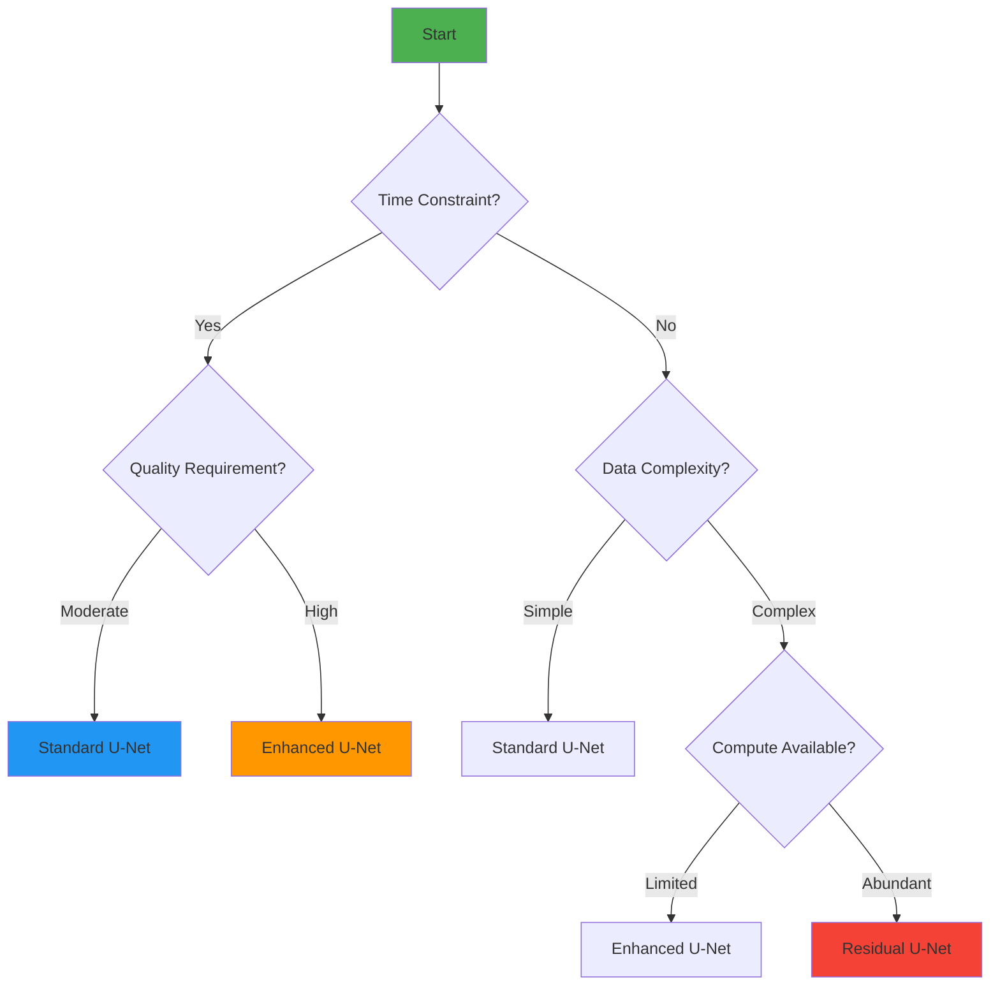

# Model Documentation

**Architecture, Training Strategy, and Performance Characteristics**

---

## Overview

NeuroScope implements multiple U-Net architecture variants optimized for microscopy image denoising. The models are designed to preserve fine cellular structures while effectively removing photon shot noise, sensor noise, and other artifacts common in microscopy imaging.

### Design Philosophy
- **Structure Preservation**: Emphasis on maintaining fine biological details
- **Efficiency**: Balance between model complexity and computational efficiency
- **Flexibility**: Multiple architecture variants for different use cases
- **Reproducibility**: Consistent training pipeline and evaluation metrics

---

## Model Architecture

### U-Net Architecture

```mermaid
graph TB
    subgraph "Input"
        A[1x256x256 Image]
    end
    
    subgraph "Encoder"
        A --> B[DoubleConv 64]
        B --> C[Down 128]
        C --> D[DoubleConv 128]
        D --> E[Down 256]
        E --> F[DoubleConv 256]
        F --> G[Down 512]
        G --> H[DoubleConv 512]
        H --> I[Down 1024]
        I --> J[DoubleConv 1024]
    end
    
    subgraph "Bottleneck"
        J --> K[Bottleneck 1024]
    end
    
    subgraph "Decoder"
        K --> L[Up 512]
        L --> M[Concat Skip 512]
        M --> N[DoubleConv 512]
        N --> O[Up 256]
        O --> P[Concat Skip 256]
        P --> Q[DoubleConv 256]
        Q --> R[Up 128]
        R --> S[Concat Skip 128]
        S --> T[DoubleConv 128]
        T --> U[Up 64]
        U --> V[Concat Skip 64]
        V --> W[DoubleConv 64]
    end
    
    subgraph "Output"
        W --> X[Conv 1x1 1]
        X --> Y[1x256x256 Output]
    end
    
    style A fill:#4CAF50
    style K fill:#FF9800
    style Y fill:#2196F3
```



### Architecture Components

#### 1. Double Convolution Block
```python
class DoubleConv(nn.Module):
    def __init__(self, in_channels, out_channels):
        super().__init__()
        self.double_conv = nn.Sequential(
            nn.Conv2d(in_channels, out_channels, kernel_size=3, padding=1),
            make_norm(out_channels),  # GroupNorm
            nn.ReLU(inplace=True),
            nn.Conv2d(out_channels, out_channels, kernel_size=3, padding=1),
            make_norm(out_channels),
            nn.ReLU(inplace=True)
        )
```

**Design Choices:**
- **3×3 Convolutions**: Standard receptive field for local feature extraction
- **GroupNorm**: Batch-size independent normalization for stability
- **Inplace ReLU**: Memory-efficient activation function
- **Padding**: Maintains spatial dimensions through convolution

#### 2. Downsampling Block
```python
class Down(nn.Module):
    def __init__(self, in_channels, out_channels):
        super().__init__()
        self.maxpool_conv = nn.Sequential(
            nn.MaxPool2d(2),  # 2× downsampling
            DoubleConv(in_channels, out_channels)
        )
```

**Design Choices:**
- **Max Pooling**: Effective for feature extraction with reduced parameters
- **Downsampling Factor**: 2× at each encoder stage
- **Feature Doubling**: Channels double at each downsampling step

#### 3. Upsampling Block
```python
class Up(nn.Module):
    def __init__(self, in_channels, out_channels, bilinear=True):
        super().__init__()
        if bilinear:
            self.up = nn.Upsample(scale_factor=2, mode='bilinear', align_corners=True)
        else:
            self.up = nn.ConvTranspose2d(in_channels, in_channels // 2, kernel_size=2, stride=2)
```

**Design Choices:**
- **Bilinear Upsampling**: Preferred for smoother results
- **Skip Connections**: Concatenation with encoder features
- **Channel Halving**: Corresponding to encoder architecture

#### 4. Residual Block (Enhanced Variant)
```python
class ResidualBlock(nn.Module):
    def __init__(self, channels):
        super().__init__()
        self.conv = nn.Sequential(
            nn.Conv2d(channels, channels, kernel_size=3, padding=1),
            make_norm(channels),
            nn.ReLU(inplace=True),
            nn.Conv2d(channels, channels, kernel_size=3, padding=1),
            make_norm(channels)
        )
        self.relu = nn.ReLU(inplace=True)
    
    def forward(self, x):
        residual = x
        out = self.conv(x)
        out += residual
        return self.relu(out)
```

**Design Choices:**
- **Residual Learning**: Enables deeper architectures
- **Gradient Flow**: Improved training stability
- **Feature Reuse**: Better utilization of learned features

---

## Model Variants

### Architecture Comparison

| Architecture | Parameters | Depth | Key Features | Best For |
|--------------|------------|-------|-------------|----------|
| **Standard U-Net** | ~31M | 4 | Classic encoder-decoder | General-purpose denoising |
| **Enhanced U-Net** | ~38M | 4 | Residual blocks in encoder | Complex noise patterns |
| **Residual U-Net** | ~42M | 4 | Full residual learning | Maximum detail preservation |

### Standard U-Net (MicroscopyUNet)
- **Parameters**: ~31 million
- **Architecture**: Classic U-Net with GroupNorm
- **Strengths**: Fast training, good baseline performance
- **Weaknesses**: May struggle with very complex noise patterns
- **Use Case**: General microscopy denoising, quick prototyping

### Enhanced U-Net (EnhancedMicroscopyUNet)
- **Parameters**: ~38 million
- **Architecture**: U-Net with residual blocks in encoder path
- **Strengths**: Better feature extraction, improved performance
- **Weaknesses**: Slower training, higher memory usage
- **Use Case**: Complex noise patterns, challenging datasets

### Residual U-Net (ResidualMicroscopyUNet)
- **Parameters**: ~42 million
- **Architecture**: Full residual learning wrapper around U-Net
- **Strengths**: Best detail preservation, handles complex structures
- **Weaknesses**: Highest computational cost, longest training time
- **Use Case**: High-value samples, maximum quality requirements

---

## Training Strategy

### Loss Function Design

#### Combined Loss Function
```python
class DenoisingLoss(nn.Module):
    def __init__(self, l1_weight=0.7, ssim_weight=0.3):
        super().__init__()
        self.l1_weight = l1_weight
        self.ssim_weight = ssim_weight
        self.l1 = nn.L1Loss()
    
    def forward(self, pred, target):
        l1_loss = self.l1(pred, target)
        ssim_val = calculate_ssim(pred, target, max_val=1.0)
        ssim_loss = 1.0 - torch.mean(ssim_val)
        return self.l1_weight * l1_loss + self.ssim_weight * ssim_loss
```

#### Loss Component Analysis

| Component | Weight | Purpose | Effect |
|-----------|--------|---------|--------|
| **L1 Loss** | 0.7 | Pixel-level accuracy | Effective noise removal |
| **SSIM Loss** | 0.3 | Structural preservation | Maintains fine details |

**Rationale**: The 0.7:0.3 balance was empirically determined to provide effective noise removal while preserving fine cellular structures. Higher L1 weight leads to better noise reduction but may oversmooth details, while higher SSIM weight preserves structures but may not remove noise as effectively.

### Optimization Strategy

#### Optimizer Configuration
```python
optimizer = optim.Adam(
    model.parameters(),
    lr=0.001,           # Initial learning rate
    betas=(0.9, 0.999), # Adam default
    weight_decay=0.0     # No L2 regularization
)
```

#### Learning Rate Scheduling
```python
scheduler = optim.lr_scheduler.ReduceLROnPlateau(
    optimizer,
    mode='max',          # Maximize validation PSNR
    factor=0.5,         # Reduce LR by 50%
    patience=5,          # Wait 5 epochs without improvement
    verbose=True
)
```

**Strategy**: Learning rate is reduced when validation PSNR plateaus, allowing finer convergence as training progresses.

### Training Hyperparameters

#### Default Configuration
```python
training_config = {
    'batch_size': 8,
    'learning_rate': 0.001,
    'epochs': 50,
    'val_split': 0.2,
    'early_stop_patience': 10,
    'augment': True,
    'model_type': 'residual'
}
```

#### Hyperparameter Guidelines

| Parameter | Range | Default | Impact |
|-----------|-------|---------|--------|
| **Batch Size** | 4-32 | 8 | Larger = faster training, more memory |
| **Learning Rate** | 0.0001-0.01 | 0.001 | Higher = faster convergence, risk of instability |
| **Epochs** | 20-200 | 50 | More = better convergence, risk of overfitting |
| **Val Split** | 0.1-0.3 | 0.2 | Higher validation = less training data |
| **Early Stop Patience** | 5-20 | 10 | Higher = longer training, risk of overfitting |

---

## Evaluation Metrics

### Primary Metrics

#### 1. Peak Signal-to-Noise Ratio (PSNR)
```python
def calculate_psnr(pred, target, max_val=1.0):
    mse = np.mean((pred - target) ** 2)
    psnr = 20.0 * np.log10(max_val) - 10.0 * np.log10(mse)
    return psnr
```

- **Range**: 0-∞ dB (practically 20-50 dB for microscopy)
- **Interpretation**: Higher is better, >30 dB considered good
- **Strengths**: Widely used, easy to compute
- **Weaknesses**: Doesn't perfectly correlate with perceived quality

#### 2. Structural Similarity Index (SSIM)
```python
def calculate_ssim(pred, target, window_size=11, max_val=1.0):
    # Local statistics calculation
    C1 = (0.01 * max_val) ** 2
    C2 = (0.03 * max_val) ** 2
    
    mu_pred = cv2.filter2D(pred, -1, kernel)
    mu_target = cv2.filter2D(target, -1, kernel)
    
    sigma_pred_sq = cv2.filter2D(pred * pred, -1, kernel) - mu_pred ** 2
    sigma_target_sq = cv2.filter2D(target * target, -1, kernel) - mu_target ** 2
    sigma_pred_target = cv2.filter2D(pred * target, -1, kernel) - mu_pred * mu_target
    
    ssim = (2 * mu_pred * mu_target + C1) * (2 * sigma_pred_target + C2)
    ssim /= ((mu_pred ** 2 + mu_target ** 2 + C1) * (sigma_pred_sq + sigma_target_sq + C2))
    
    return float(np.mean(ssim))
```

- **Range**: -1 to 1 (typically 0.7-0.99 for microscopy)
- **Interpretation**: Higher is better, >0.85 considered good
- **Strengths**: Correlates well with perceived quality
- **Weaknesses**: Computationally more expensive

### Secondary Metrics

#### 3. Mean Absolute Error (MAE)
```python
def calculate_mae(pred, target):
    return np.mean(np.abs(pred - target))
```

- **Range**: 0-1 (for normalized images)
- **Interpretation**: Lower is better
- **Use Case**: Complementary to MSE, less sensitive to outliers

#### 4. Mean Squared Error (MSE)
```python
def calculate_mse(pred, target):
    return np.mean((pred - target) ** 2)
```

- **Range**: 0-1 (for normalized images)
- **Interpretation**: Lower is better
- **Use Case**: Foundation for PSNR calculation

---

## Model Performance

### Training Performance

#### Training Time Estimates
| Hardware | Batch Size | Time per Epoch | Total Training Time (50 epochs) |
|----------|------------|----------------|-------------------------------|
| **CPU (Modern)** | 4 | ~5 min | ~4 hours |
| **GPU (RTX 3060)** | 8 | ~30 sec | ~25 min |
| **GPU (RTX 3080)** | 16 | ~15 sec | ~12 min |
| **GPU (V100)** | 16 | ~10 sec | ~8 min |

#### Memory Requirements
| Hardware | Batch Size 4 | Batch Size 8 | Batch Size 16 |
|----------|-------------|-------------|--------------|
| **CPU (16GB RAM)** | ~4GB | ~6GB | ~10GB |
| **GPU (8GB VRAM)** | ~2GB | ~3GB | ~6GB |
| **GPU (16GB VRAM)** | ~2GB | ~3GB | ~4GB |

### Inference Performance

#### Latency Comparison
| Hardware | Standard U-Net | Enhanced U-Net | Residual U-Net |
|----------|----------------|----------------|----------------|
| **CPU (Modern)** | ~120ms | ~150ms | ~180ms |
| **GPU (RTX 3060)** | ~25ms | ~30ms | ~35ms |
| **GPU (RTX 3080)** | ~18ms | ~22ms | ~28ms |
| **GPU (V100)** | ~15ms | ~18ms | ~22ms |

#### Quality Comparison (Typical Results)
| Architecture | PSNR (dB) | SSIM | Training Time | Inference Time |
|--------------|-----------|------|---------------|----------------|
| **Standard U-Net** | 32.5 | 0.87 | Fast | Fast |
| **Enhanced U-Net** | 34.2 | 0.90 | Medium | Medium |
| **Residual U-Net** | 35.1 | 0.92 | Slow | Slow |

---

## Model Limitations

### Known Limitations

#### 1. Resolution Constraints
- **Input Size**: Fixed to 256×256 during training
- **Output Size**: Original resolution preserved through resizing
- **Impact**: Very high-resolution images may lose fine details
- **Mitigation**: Use higher training resolution or patch-based processing

#### 2. Generalization Limits
- **Training Domain**: Models perform best on data similar to training set
- **Modality Specific**: Optimized for fluorescence microscopy
- **Noise Types**: Trained on specific noise patterns
- **Mitigation**: Train on diverse datasets, use transfer learning

#### 3. Memory Constraints
- **GPU Memory**: Limited batch sizes on consumer GPUs
- **CPU Memory**: Large images may exceed available RAM
- **Impact**: Hardware constraints affect performance
- **Mitigation**: Use gradient accumulation, smaller batches

#### 4. Processing Time
- **GPU Dependency**: Optimal performance requires GPU
- **CPU Inference**: Significantly slower on CPU
- **Impact**: Real-time processing challenging
- **Mitigation**: Use ONNX runtime, model optimization

### Failure Modes

#### 1. Over-smoothing
- **Symptoms**: Loss of fine cellular structures
- **Causes**: Excessive L1 loss, inadequate SSIM weight
- **Solution**: Adjust loss function weights, reduce training epochs

#### 2. Incomplete Denoising
- **Symptoms**: Noise remains in output images
- **Causes**: Insufficient training, low SNR training data
- **Solution**: Increase training data, improve data quality

#### 3. Artifacts Introduction
- **Symptoms**: New patterns appear in output
- **Causes**: Overfitting, training data issues
- **Solution**: Regularization, better data quality, early stopping

#### 4. Color Casts (RGB Input)
- **Symptoms**: Incorrect color in denoised output
- **Causes**: Improper grayscale conversion
- **Solution**: Use proper RGB to grayscale conversion

---

## Model Selection Guide

### Choosing the Right Model

#### Use Case Decision Tree


### Recommendations by Use Case

| Use Case | Recommended Model | Rationale |
|----------|------------------|-----------|
| **Quick Prototyping** | Standard U-Net | Fast training, good baseline |
| **Publication Quality** | Residual U-Net | Best quality, worth the time |
| **Production Service** | Enhanced U-Net | Good balance of quality and speed |
| **Resource Constrained** | Standard U-Net | Lowest memory requirements |
| **Complex Samples** | Residual U-Net | Handles challenging cases best |

---

## Model Fine-tuning

### Transfer Learning Workflow

```python
# Load pre-trained model
checkpoint = torch.load('pretrained_model.pth')
model.load_state_dict(checkpoint['model_state_dict'])

# Modify for new dataset
# (e.g., different input/output channels)
model = modify_model_architecture(model)

# Fine-tune with lower learning rate
optimizer = optim.Adam(model.parameters(), lr=0.0001)
```

### Fine-tuning Guidelines

| Scenario | Learning Rate | Epochs | Data Required |
|----------|---------------|---------|---------------|
| **Similar Domain** | 0.0001 | 10-20 | Small (100-500 pairs) |
| **Different Domain** | 0.001 | 30-50 | Medium (500-2000 pairs) |
| **New Modality** | 0.001 | 50-100 | Large (2000+ pairs) |

---

## Model Interpretation

### Feature Visualization

#### Encoder Features
- **Early Layers**: Edge detection, simple patterns
- **Middle Layers**: Texture, local structures
- **Deep Layers**: Semantic features, complex patterns

#### Decoder Features
- **Early Layers**: Coarse reconstruction
- **Middle Layers**: Detail refinement
- **Final Layers**: Fine detail restoration

### Attention Mechanisms (Future)
```python
# Planned feature for future versions
class AttentionGate(nn.Module):
    """Attention mechanism for skip connection importance"""
    def __init__(self, channels):
        super().__init__()
        self.attention = nn.Sequential(
            nn.Conv2d(channels, channels, kernel_size=1),
            nn.Sigmoid()
        )
```

---

## Model Deployment

### Export Formats

#### 1. PyTorch Checkpoint
```bash
python scripts/export_inference_checkpoint.py \
  --input models/best_model.pth \
  --output models/deploy/model.pt
```

#### 2. ONNX Format (Optional)
```bash
python scripts/export_to_onnx.py \
  --input models/deploy/model.pt \
  --output models/deploy/model.onnx \
  --opset 17
```

### Deployment Considerations

| Format | Size | Speed | Compatibility |
|--------|------|-------|---------------|
| **PyTorch** | ~120MB | Fast | PyTorch environments |
| **ONNX** | ~80MB | Fastest | ONNX Runtime environments |

---

## Troubleshooting Model Issues

### Training Issues

#### 1. Loss Not Decreasing
**Symptoms**: Training loss remains high throughout training

**Potential Causes**:
- Learning rate too high or too low
- Data quality issues
- Model architecture mismatch
- Incorrect loss function

**Solutions**:
- Try different learning rates (0.0001, 0.01)
- Verify data quality and preprocessing
- Check model architecture matches checkpoint
- Review loss function implementation

#### 2. Overfitting
**Symptoms**: Training loss decreases, validation loss increases

**Potential Causes**:
- Model too complex for dataset size
- Insufficient regularization
- Training too many epochs

**Solutions**:
- Reduce model complexity
- Add data augmentation
- Implement early stopping
- Increase dropout (if added)

#### 3. Underfitting
**Symptoms**: Both training and validation loss remain high

**Potential Causes**:
- Model too simple
- Insufficient training time
- Learning rate too low

**Solutions**:
- Increase model complexity
- Train for more epochs
- Increase learning rate
- Check data preprocessing

### Inference Issues

#### 1. Poor Denoising Quality
**Symptoms**: Output quality worse than expected

**Potential Causes**:
- Model not fully trained
- Input data outside training distribution
- Incorrect preprocessing

**Solutions**:
- Verify model training convergence
- Check input data characteristics
- Ensure preprocessing pipeline matches training

#### 2. Artifacts in Output
**Symptoms**: Unusual patterns in denoised images

**Potential Causes**:
- Overfitting to training data
- Checkpoint corruption
- Incorrect postprocessing

**Solutions**:
- Use earlier checkpoint
- Verify checkpoint integrity
- Check postprocessing pipeline

---

## Model Versioning

### Version Control Strategy

```python
# Model versioning in checkpoints
checkpoint = {
    'epoch': epoch,
    'model_type': 'residual',
    'model_state_dict': model.state_dict(),
    'optimizer_state_dict': optimizer.state_dict(),
    'val_loss': val_loss,
    'val_psnr': val_psnr,
    'val_ssim': val_ssim,
    'version': '1.0.0',
    'timestamp': datetime.now().isoformat()
}
```

### Version Guidelines
- **Major Version**: Architecture changes
- **Minor Version**: Training improvements
- **Patch Version**: Bug fixes

---

<div align="center">

**Robust model architecture is the foundation of effective AI denoising**

[⬆ Back to Wiki Home](Home) | [← Dataset Documentation](Dataset-Documentation) | [Installation Guide](Installation-Guide) →

</div>
