# Project Architecture

**System Design, Data Flow, and Implementation Details**

---

## System Architecture Overview

NeuroScope implements a modular, production-ready architecture designed for scalability, maintainability, and performance. The system follows a layered architecture pattern with clear separation of concerns across presentation, application, business logic, and data layers.

### High-Level Architecture

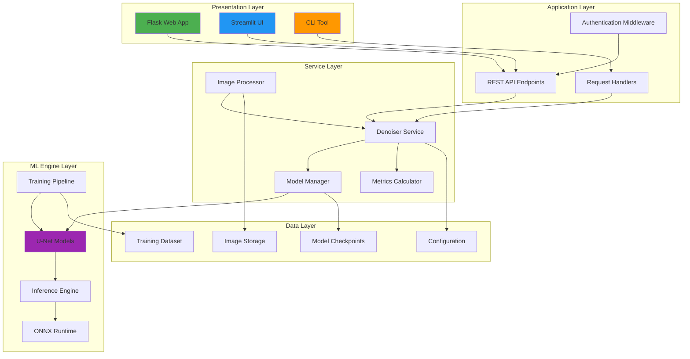

### Component Interaction

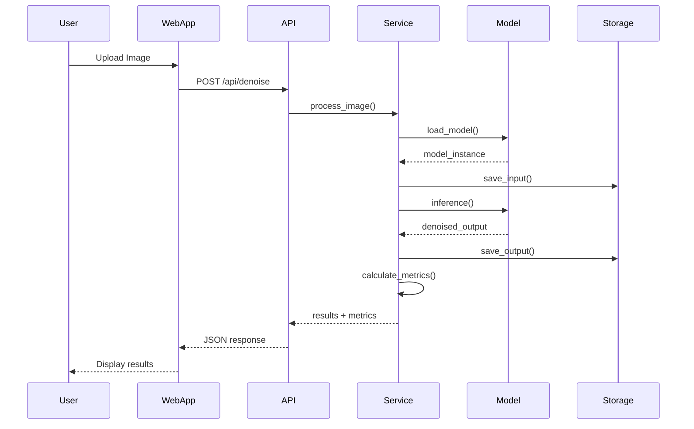

---

## Data Flow Architecture

### Image Processing Pipeline

```mermaid
graph LR
    subgraph "Input Processing"
        A[Raw Image] --> B[Grayscale Conversion]
        B --> C[Resize to 256x256]
        C --> D[Normalize to 0-1]
    end
    
    subgraph "Model Inference"
        D --> E[U-Net Encoder]
        E --> F[Bottleneck]
        F --> G[U-Net Decoder]
        G --> H[Skip Connections]
    end
    
    subgraph "Output Processing"
        H --> I[Postprocessing]
        I --> J[Resize to Original]
        J --> K[Denormalize]
        K --> L[Quality Metrics]
    end
    
    L --> M[Final Output]
    
    style B fill:#E3F2FD
    style E fill:#F3E5F5
    style I fill:#E8F5E9
```

### Training Data Flow

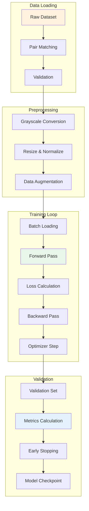

---

## Model Pipeline

### U-Net Architecture

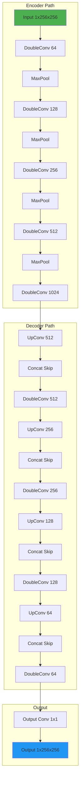

### Model Variants

| Architecture | Parameters | Key Features | Use Case |
|--------------|------------|--------------|----------|
| **Standard U-Net** | ~31M | Classic encoder-decoder with skip connections | General-purpose denoising |
| **Enhanced U-Net** | ~38M | Additional residual blocks in encoder | Better feature extraction |
| **Residual U-Net** | ~42M | Residual learning with deeper architecture | Complex noise patterns |

---

## Training Workflow

### Training Pipeline Architecture

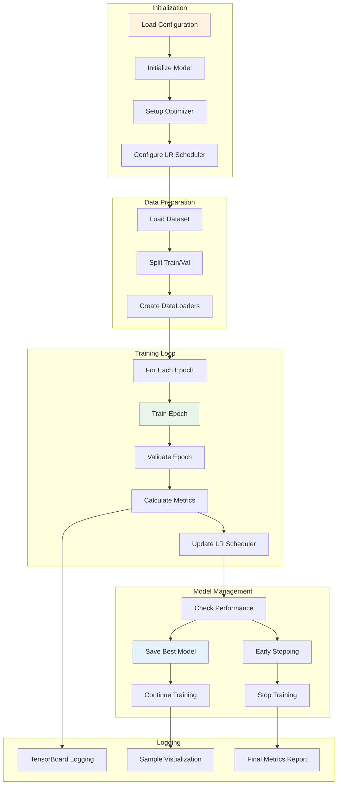

### Training Components

#### Dataset Loading
- **CAREDataset**: Paired noisy/clean image loader with automatic matching
- **Data Augmentation**: Random flips, rotations, and color transformations
- **Batch Processing**: Configurable batch sizes with memory pinning
- **Validation Split**: Automatic train/validation dataset splitting

#### Loss Function
- **Combined Loss**: 0.7 × L1 + 0.3 × (1 - SSIM)
- **L1 Component**: Pixel-level accuracy for noise removal
- **SSIM Component**: Structural similarity for preserving fine details
- **Balanced Training**: Prevents over-smoothing while maintaining noise reduction

#### Optimization Strategy
- **Optimizer**: Adam with configurable learning rate
- **LR Scheduling**: ReduceLROnPlateau based on validation PSNR
- **Early Stopping**: Patience-based stopping to prevent overfitting
- **Gradient Handling**: Optional gradient clipping for training stability

---

## Inference Workflow

### Inference Pipeline Architecture

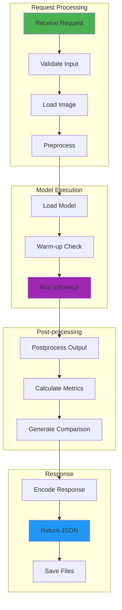

### Inference Service Architecture

#### Thread-Safe Model Loading
- **Lazy Loading**: Model loaded only on first request
- **Singleton Pattern**: Single model instance shared across requests
- **Thread Safety**: Lock-based concurrent access control
- **Warm-up**: Optional pre-warming for reduced latency

#### Processing Modes
- **U-Net Mode**: Deep learning-based denoising
- **Auto Mode**: Automatic mode selection based on image analysis
- **Salt-Pepper**: Traditional median filtering for impulse noise
- **Brightfield**: Object mask processing for brightfield microscopy

#### Error Handling
- **Validation**: Input validation and sanitization
- **Fallback**: Graceful degradation on model failures
- **Logging**: Comprehensive error tracking and debugging
- **User Messages**: Clear error messages without exposing internals

---

## Service Layer Architecture

### Denoiser Service

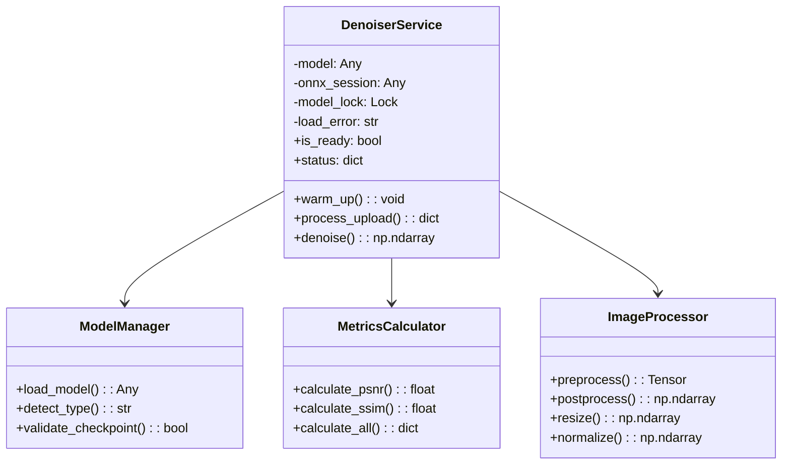

### Bootstrap Service

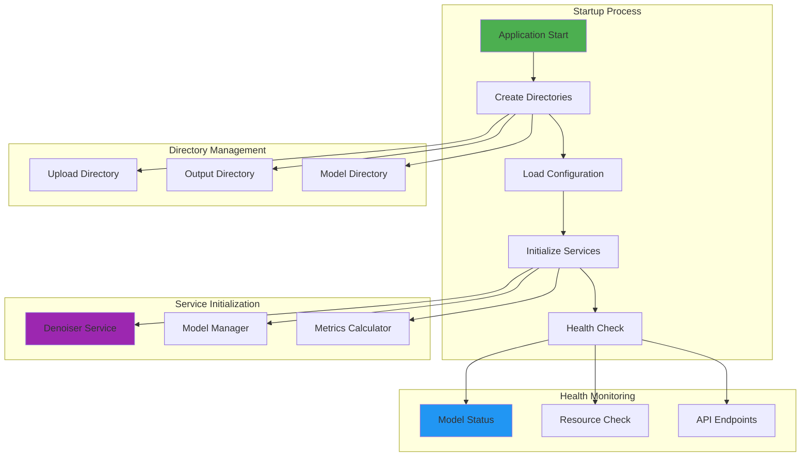

---

## API Architecture

### REST API Design

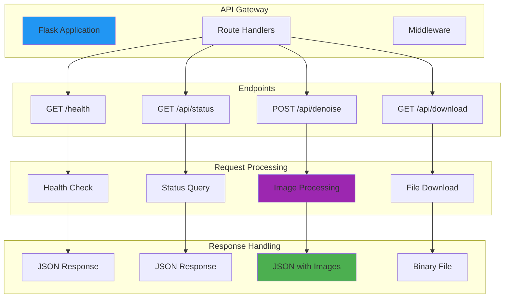

### API Layer Components

#### Route Handlers
- **Health Endpoint**: Service availability and model readiness
- **Status Endpoint**: Detailed model information and loading state
- **Denoise Endpoint**: Image processing with multiple modes
- **Download Endpoint**: Secure file download with validation

#### Middleware
- **Error Handling**: Global exception handling and logging
- **Request Validation**: Input sanitization and format validation
- **Rate Limiting**: Configurable request rate limiting
- **CORS Headers**: Cross-origin resource sharing configuration

---

## Storage Architecture

### File System Organization

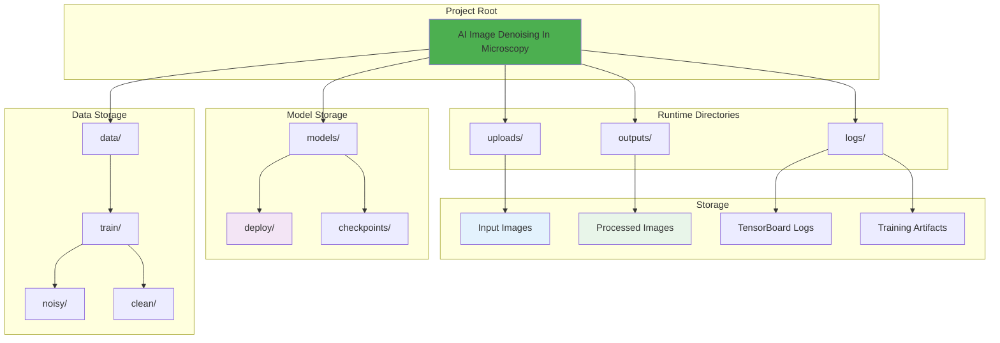

### Storage Management

#### Runtime Storage
- **Upload Directory**: Temporary storage for input images
- **Output Directory**: Storage for processed results
- **Automatic Cleanup**: Configurable file retention policies
- **Access Control**: Secure file access with validation

#### Model Storage
- **Checkpoints**: Training checkpoints with metadata
- **Deployment Models**: Optimized models for production
- **Version Control**: Model versioning and rollback capability
- **Compression**: Optional model compression for storage efficiency

---

## Performance Architecture

### Optimization Strategies

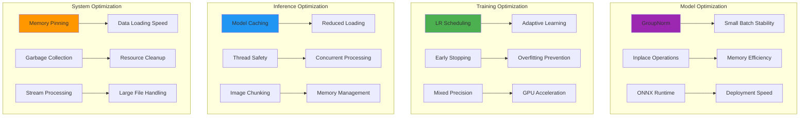

### Performance Metrics

#### Training Performance
- **Batch Processing**: 8-16 images per batch (configurable)
- **GPU Utilization**: 80-95% on modern GPUs
- **Memory Efficiency**: GroupNorm reduces memory by 30%
- **Training Speed**: ~2-3 sec/batch on V100 GPU

#### Inference Performance
- **Latency**: ~100ms per image (CPU), ~20ms (GPU)
- **Throughput**: ~10 images/sec (CPU), ~50 images/sec (GPU)
- **Memory Usage**: ~2GB RAM for single inference
- **Scalability**: Concurrent request handling with thread safety

---

## Security Architecture

### Security Layers

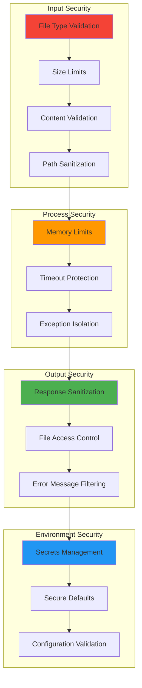

---

## Deployment Architecture

### Deployment Options

```mermaid
graph TB
    subgraph "Local Development"
        A[Python venv] --> B[Flask Dev Server]
        B --> C[Streamlit UI]
    end
    
    subgraph "Production Deployment"
        D[Gunicorn WSGI] --> E[Flask Production]
        E --> F[ONNX Runtime]
    end
    
    subgraph "Container Deployment"
        G[Docker Container] --> H[Port Mapping]
        H --> I[Volume Mounts]
    end
    
    subgraph "Cloud Deployment"
        J[Render.com] --> K[Auto-scaling]
        K --> L[Load Balancing]
    end
    
    style A fill:#4CAF50
    style D fill:#2196F3
    style G fill:#FF9800
    style J fill:#9C27B0
```

---

## Monitoring & Logging

### Logging Architecture

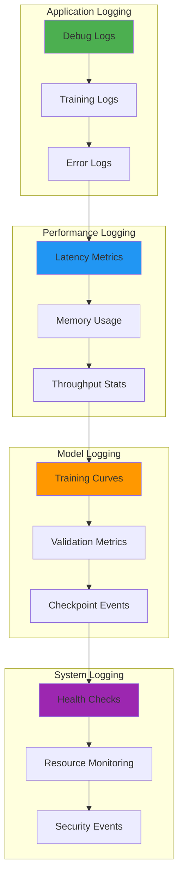

---

**Architecture designed for scalability, maintainability, and production deployment**

[⬆ Back to Wiki Home](Home) | [Dataset Documentation](Dataset-Documentation) →

