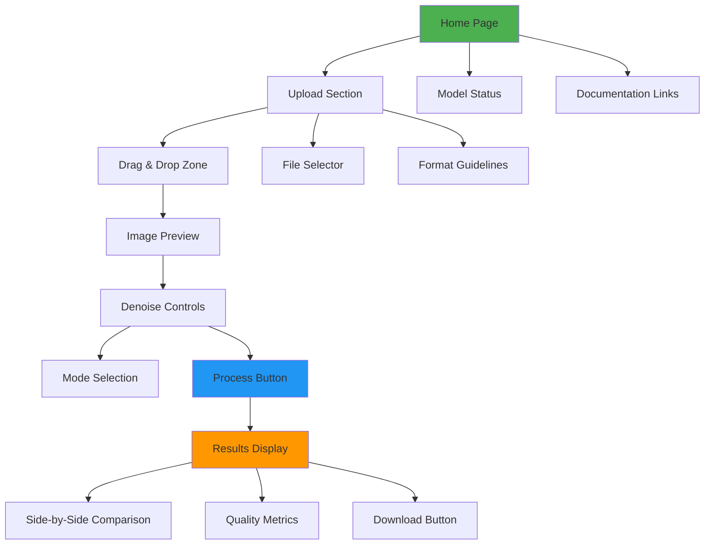

# User Guide

**Complete Guide for Using NeuroScope Applications**

---

## Overview

This comprehensive user guide covers all aspects of using NeuroScope, from basic image denoising to advanced configuration and optimization. Whether you're a researcher, clinician, or developer, this guide will help you make the most of the system's capabilities.

### User Personas
- **Researchers**: Biological researchers using microscopy imaging
- **Clinicians**: Medical professionals processing diagnostic images
- **Students**: Learning AI applications in image processing
- **Developers**: Integrating denoising into existing workflows

---

## Quick Start

### First-Time Setup

#### Step 1: Launch Application

```bash
# Flask Web Application
python application.py

# Or Streamlit Interface
streamlit run app.py
```

#### Step 2: Access Interface

- **Flask App**: http://localhost:5000
- **Streamlit**: http://localhost:8501

#### Step 3: Upload Image

1. Click on the upload area or drag and drop an image
2. Select your microscopy image (PNG, JPG, TIFF, etc.)
3. Wait for the image to upload and preview

#### Step 4: Run Denoising

1. Select denoising mode (Auto recommended)
2. Click "Start denoising" button
3. Wait for processing to complete

#### Step 5: Download Results

1. Review the side-by-side comparison
2. Check quality metrics (PSNR, SSIM)
3. Click download button to save denoised image

---

## Web Application Usage

### Flask Web Interface

#### Interface Overview



#### Uploading Images

**Method 1: Drag and Drop**
- Drag image file from file explorer
- Drop onto upload zone
- Automatic file validation

**Method 2: File Selection**
- Click "Browse files" button
- Select image from file dialog
- Confirm upload

**Supported Formats:**
- PNG (recommended for lossless quality)
- JPEG/JPG (smaller file size)
- TIFF/TIFF (high-quality microscopy format)
- WebP (modern web format)
- BMP (uncompressed format)

**File Size Limit:**
- Default: 50MB
- Configurable via `MAX_UPLOAD_MB` environment variable

#### Denoising Modes

##### Auto Mode (Recommended)
- **Description**: Automatically selects optimal denoising method
- **Algorithm**: Analyzes image characteristics and chooses best approach
- **Best For**: General use, unknown image types
- **Processing Time**: Variable (depends on selected method)

##### U-Net Mode
- **Description**: Deep learning-based denoising
- **Algorithm**: Trained U-Net model
- **Best For**: General noise reduction, preserving fine details
- **Processing Time**: ~100ms (CPU), ~20ms (GPU)

##### Salt-Pepper Filter
- **Description**: Traditional median filtering
- **Algorithm**: Adaptive median filter
- **Best For**: Impulse noise, salt-and-pepper artifacts
- **Processing Time**: ~50ms

##### Brightfield Object Mask
- **Description**: Brightfield microscopy processing
- **Algorithm**: Object-based masking and filtering
- **Best For**: Brightfield microscopy images
- **Processing Time**: ~80ms

#### Understanding Results

##### Quality Metrics

**PSNR (Peak Signal-to-Noise Ratio)**
- **Range**: 0-∞ dB (typically 20-50 dB for microscopy)
- **Interpretation**:
  - >40 dB: Excellent quality
  - 30-40 dB: Good quality
  - 20-30 dB: Fair quality
  - <20 dB: Poor quality

**SSIM (Structural Similarity Index)**
- **Range**: -1 to 1 (typically 0.7-0.99 for microscopy)
- **Interpretation**:
  - >0.95: Excellent structural preservation
  - 0.85-0.95: Good structural preservation
  - 0.70-0.85: Fair structural preservation
  - <0.70: Poor structural preservation

##### Visual Comparison

**Original vs Denoised**
- **Left**: Original noisy input
- **Right**: AI-denoised output
- **Purpose**: Visual assessment of denoising quality

**Quality Assessment Tips**
- Look for preservation of fine cellular structures
- Check for introduction of artifacts
- Verify noise reduction effectiveness
- Compare edge sharpness

#### Downloading Results

**Individual Download**
- Click download button below denoised image
- Select save location
- Choose file format (PNG recommended)

**Batch Processing**
- Use CLI tool for batch processing (see CLI section)
- Process entire directories at once
- Generate comparison reports

---

## Streamlit Interface

### Streamlit UI Features

#### Advantages of Streamlit
- **Interactive**: Real-time parameter adjustment
- **Python-native**: Easy to modify and extend
- **Prototype-friendly**: Quick testing and development
- **Local Use**: Ideal for local development and testing

#### Streamlit Workflow

```python
# Launch Streamlit
streamlit run app.py

# Interface features:
# - Model selection and configuration
# - Real-time parameter adjustment
# - Interactive quality metrics
# - Side-by-side comparison
# - Download options
```

#### Streamlit Controls

**Model Configuration**
- Select model variant (Standard, Enhanced, Residual)
- Choose device (CPU/GPU)
- Configure processing parameters

**Image Processing**
- Upload single or multiple images
- Adjust preprocessing options
- Select denoising mode
- Monitor processing progress

**Results Display**
- Interactive before/after comparison
- Real-time quality metrics
- Download individual or batch results

---

## CLI Usage

### Basic CLI Commands

#### Single Image Processing

```bash
python inference.py \
  --model models/deploy/model.pt \
  --input path/to/noisy_image.png \
  --output results/
```

**Output:**
- Denoised image saved to output directory
- Optional comparison image generated
- Quality metrics printed to console

#### Batch Directory Processing

```bash
python inference.py \
  --model models/deploy/model.pt \
  --input_dir path/to/noisy_images/ \
  --output_dir results/ \
  --batch
```

**Features:**
- Process all images in directory
- Maintain original filenames
- Generate summary report

#### Advanced Options

```bash
python inference.py \
  --model models/deploy/model.pt \
  --input image.png \
  --output results/ \
  --ground_truth clean_image.png \
  --save_comparison \
  --metrics_only \
  --device cuda \
  --mode unet
```

### CLI Parameters

| Parameter | Description | Default | Required |
|-----------|-------------|---------|----------|
| `--model` | Path to model checkpoint | `models/deploy/model.pt` | Yes |
| `--input` | Input image path | - | Yes (or --input_dir) |
| `--input_dir` | Input directory for batch | - | Yes (or --input) |
| `--output` | Output directory | `results/` | No |
| `--ground_truth` | Ground truth for metrics | - | No |
| `--save_comparison` | Save comparison image | False | No |
| `--metrics_only` | Only calculate metrics | False | No |
| `--device` | Device (cpu/cuda) | cpu | No |
| `--mode` | Denoising mode | auto | No |
| `--batch` | Batch processing mode | False | No |

---

## Best Practices

### Image Preparation

#### Optimal Input Characteristics

**Resolution**
- **Recommended**: 512×512 to 2048×2048
- **Minimum**: 128×128
- **Maximum**: 8192×8192 (with sufficient memory)

**Format Selection**
- **PNG**: Best for lossless quality
- **TIFF**: Best for scientific imaging
- **JPEG**: Acceptable for web use
- **Avoid**: Highly compressed formats

**Quality Considerations**
- Use original uncompressed images when possible
- Avoid multiple compression cycles
- Maintain consistent bit depth
- Preserve metadata when relevant

#### Common Mistakes to Avoid

❌ **Don't**: Use over-compressed JPEG images
❌ **Don't**: Process already-denoised images
❌ **Don't**: Use images with incompatible color spaces
❌ **Don't**: Exceed file size limits

✅ **Do**: Use high-quality original images
✅ **Do**: Verify image format compatibility
✅ **Do**: Check image resolution before processing
✅ **Do**: Maintain backup copies of originals

### Denoising Strategy

#### Mode Selection Guide

| Image Type | Recommended Mode | Reason |
|------------|------------------|---------|
| **Fluorescence Microscopy** | Auto or U-Net | Balanced noise reduction |
| **Brightfield** | Brightfield Mask | Optimized for modality |
| **SEM/TEM** | U-Net | Preserves fine structures |
| **Salt-Pepper Noise** | Salt-Pepper Filter | Specialized algorithm |
| **Unknown Type** | Auto | Automatic selection |

#### Quality vs. Speed Trade-offs

| Priority | Recommended Configuration | Speed | Quality |
|----------|---------------------------|-------|---------|
| **Maximum Quality** | Residual U-Net, GPU | Slow | Best |
| **Balanced** | Enhanced U-Net, GPU | Medium | Good |
| **Fast Processing** | Standard U-Net, CPU | Fast | Fair |
| **Quick Preview** | Salt-Pepper, CPU | Fastest | Basic |

### Batch Processing Workflow

#### Efficient Batch Processing

```bash
# Step 1: Organize input directory
mkdir -p input_data output_results
cp *.png input_data/

# Step 2: Run batch processing
python inference.py \
  --model models/deploy/model.pt \
  --input_dir input_data/ \
  --output_dir output_results/ \
  --batch

# Step 3: Review results
ls output_results/
```

#### Batch Processing Tips

- **Organize Inputs**: Group similar images together
- **Monitor Progress**: Check console output for status
- **Review Outputs**: Sample check before full review
- **Backup Originals**: Keep original images safe
- **Automate**: Use scripts for repetitive tasks

---

## Advanced Usage

### Custom Configuration

#### Environment Variables

```bash
# Set custom model path
export MODEL_PATH=/custom/path/to/model.pt

# Change server port
export PORT=8080

# Enable GPU
export DEVICE=cuda

# Increase upload limit
export MAX_UPLOAD_MB=100
```

#### Configuration File

```python
# config.py modifications
import os

# Custom model path
MODEL_PATH = os.environ.get('MODEL_PATH', 'custom_model.pt')

# Custom image size
IMAGE_SIZE = (512, 512)  # Default: (256, 256)

# Custom normalization
NORMALIZE_RANGE = (0, 1)  # Default: (0, 1)
```

### Performance Optimization

#### GPU Acceleration

```bash
# Verify GPU availability
python -c "import torch; print(torch.cuda.is_available())"

# Use GPU for inference
python inference.py \
  --model models/deploy/model.pt \
  --input image.png \
  --device cuda
```

#### Memory Optimization

```bash
# Reduce batch size for memory constraints
python train.py \
  --batch_size 4 \
  --data_dir data

# Use CPU if GPU memory insufficient
python inference.py \
  --device cpu \
  --input image.png
```

### Integration with Workflows

#### Python Integration

```python
from services.denoiser import DenoiserService
import cv2

# Initialize service
service = DenoiserService()
service.warm_up()

# Process image
image = cv2.imread('noisy.png', cv2.IMREAD_GRAYSCALE)
denoised = service.denoise(image, mode='unet')

# Save result
cv2.imwrite('denoised.png', denoised)
```

#### API Integration

```python
import requests

# Upload and denoise image
with open('noisy.png', 'rb') as f:
    response = requests.post(
        'http://localhost:5000/api/denoise',
        files={'image': f},
        data={'mode': 'unet'}
    )

# Get result
result = response.json()
denoised_b64 = result['denoised_b64']
```

---

## Troubleshooting User Issues

### Common User Problems

#### Issue 1: Upload Fails

**Symptoms**: File upload fails or times out

**Solutions**:
- Check file size (limit: 50MB default)
- Verify file format is supported
- Check network connection
- Try smaller file first

#### Issue 2: Poor Denoising Quality

**Symptoms**: Output quality worse than expected

**Solutions**:
- Try different denoising mode
- Verify input image quality
- Check if image matches training distribution
- Use higher quality model variant

#### Issue 3: Processing Takes Too Long

**Symptoms**: Very slow processing times

**Solutions**:
- Use GPU if available
- Try smaller image size
- Use simpler denoising mode
- Check system resources

#### Issue 4: Model Not Loading

**Symptoms**: Model status shows "not ready"

**Solutions**:
- Verify model file exists at correct path
- Check model file integrity
- Verify model compatibility
- Check system logs for errors

---

## Tips and Tricks

### Workflow Optimization

#### Efficient Image Management
- Organize images in logical directories
- Use descriptive filenames
- Maintain consistent naming conventions
- Keep backup copies of originals

#### Quality Assurance
- Process sample images first
- Compare different denoising modes
- Check metrics for unexpected results
- Verify output integrity

### Performance Tips

#### Speed Optimization
- Use GPU when available
- Process similar images in batches
- Use appropriate denoising mode
- Optimize image size when possible

#### Quality Optimization
- Use highest quality input images
- Choose appropriate denoising mode
- Use Residual U-Net for best quality
- Verify results before use in production

---

## Example Workflows

### Research Workflow

```bash
# 1. Prepare microscopy images
mkdir -p microscopy_data/{noisy,clean}
# Copy images to appropriate directories

# 2. Train custom model (optional)
python train.py \
  --data_dir microscopy_data \
  --epochs 50 \
  --save_dir models/research

# 3. Export for deployment
python scripts/export_inference_checkpoint.py \
  --input models/research/best_model.pth \
  --output models/deploy/model.pt

# 4. Process experimental data
python inference.py \
  --model models/deploy/model.pt \
  --input_dir experimental_data/ \
  --output_dir processed_data/ \
  --batch

# 5. Review and analyze results
python analyze_results.py processed_data/
```

### Clinical Workflow

```bash
# 1. Start web application
python application.py

# 2. Access web interface
# Navigate to http://localhost:5000

# 3. Process patient images
# - Upload diagnostic images
# - Run denoising with U-Net mode
# - Review quality metrics
# - Download processed images

# 4. Quality control
# - Verify preservation of diagnostic features
# - Check for artifacts
# - Confirm acceptable quality metrics
```

---

## User Feedback and Support

### Getting Help

#### Documentation Resources
- [Installation Guide](Installation-Guide) - Setup and configuration
- [API Documentation](API-Documentation) - API reference
- [FAQ](FAQ) - Common questions and answers
- [Troubleshooting](#troubleshooting-user-issues) - Problem-solving

#### Community Support
- **GitHub Issues**: Report bugs and request features
- **GitHub Discussions**: Ask questions and share experiences
- **Email Support**: Contact for technical assistance

### Providing Feedback

#### Bug Reports
- Describe the issue clearly
- Provide system information
- Include error messages
- Share steps to reproduce

#### Feature Requests
- Describe the desired feature
- Explain use case
- Suggest implementation approach
- Consider contribution

---

## Security and Privacy

### Data Privacy

#### Local Processing
- All processing performed locally
- No data transmitted to external servers
- User maintains control over all data

#### Security Considerations
- Validate all file uploads
- Sanitize user inputs
- Use secure authentication (production)
- Regular security updates

### Best Practices

#### Data Handling
- Backup important images
- Use secure file permissions
- Encrypt sensitive data
- Follow institutional guidelines

#### Access Control
- Implement authentication in production
- Use secure communication (HTTPS)
- Regular security audits
- Update dependencies regularly

---

<div align="center">

**Effective use of NeuroScope enhances microscopy image quality and research outcomes**

[⬆ Back to Wiki Home](Home) | [← Installation Guide](Installation-Guide) | [API Documentation](API-Documentation) →

</div>
